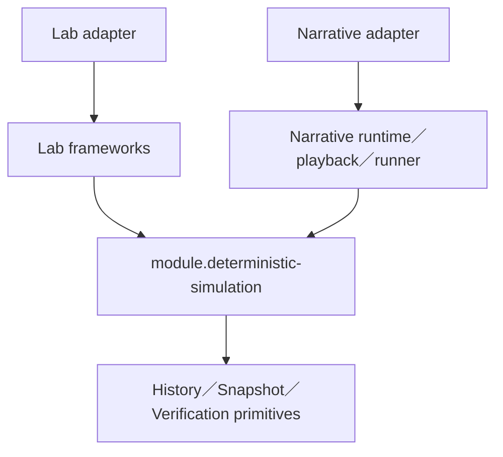
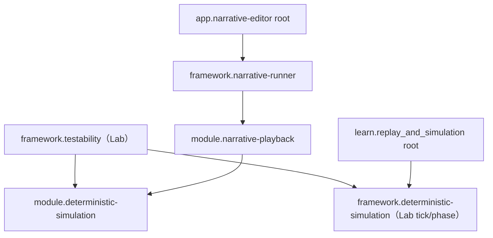

# Deep Research v2：將 Lab 與 Narrative 下沉為共用的 Deterministic Simulation 系列模組

研究日期：2026-09-01

研究基準：

- `learn.replay_and_simulation`：main `dd9f748b6298fcbdd43f3fb16baf9cfa7493ea6b`，本次已重新驗證。
- `app.narrative-editor` 與 Narrative submodules：所有權已由 `angus945` 轉移至 `crafty-racoon`。本次 GitHub 連接範圍尚未暴露該私有組織，因此 Narrative 程式碼仍以轉移前已完整讀取、固定的 content-addressed commits 為分析基準：
  - app：`5f5dc3f4fe03356909db8f87d5aa58a19bd738e2`
  - runtime：`a4e8785542bbf3749624d1e27e8f2c44b7bc5159`
  - playback：`5d47902cd20048be92f1e2921206c2b1788a8216`
  - runner：`f1fd0aebd4e475ab5025def9c80eae34ca7ebde9`
- 公司運營企劃／「重用模組管理」分頁。

> 所有權轉移不改變既有 Git object 的內容與 commit SHA；但若 `crafty-racoon/*` 在轉移後已有新 commit，本報告未聲稱已驗證那些新變更。

## 1. 修正後的結論

前一版把共同層收斂在「replay orchestration」，判斷過度保守。重新以使用者提出的模型檢查後，較準確的結論是：

**兩個系統可以共同依賴一個 domain-neutral deterministic simulation kernel。共同核心不是 tick、script、command 或 time，而是離散的 deterministic state transition。**

形式上：

\[
(S_{n+1}, E_n) = \operatorname{Step}_R(S_n, I_n)
\]

- \(S_n\)：第 \(n\) 步之前的完整可還原狀態。
- \(I_n\)：這一步消費的所有外部／非決定性輸入。
- \(E_n\)：結果、事件、digest 或其他可用來證明重播一致的 evidence。
- \(R\)：規則、程式、codec、命令組合與狀態 schema 的 semantic revision。
- \(n\)：單調遞增的 `StepIndex`，不代表秒數。

套回兩個專案：

| 概念 | Replay Lab | Narrative |
|---|---|---|
| Initial input | scenario、seed、起始 world | script／execution plan、definition revision、起始演出狀態 |
| External step input | 指派到該 tick 的 player／test inputs | Continue、對話選項、外部讀值／signal |
| Step | fixed simulation tick | 一個可確定重建的 narrative execution boundary |
| State | world、RNG、pending work、identity counters | runtime cursor、variables、command lifetimes、演出 participant state |
| Evidence | state hash、ActionResult、failure、invariant | RuntimeEvent、input-read sequence、state digest／mismatch |
| Snapshot | 尚待補上的 authoritative world snapshot | RuntimeCheckpoint + playback state participant snapshots |
| Seek | 最近 snapshot + 重跑剩餘 ticks | 最近 checkpoint + 重跑剩餘 narrative steps |

因此，正確的依賴關係是兩者共同向下依賴中性模組：



共同模組不引用任何 Lab 或 Narrative type；兩個專案也不互相引用。

## 2. 「沒有時間，只有 Step」是可行的

### 2.1 時間不需要是共同核心的一級概念

Deterministic state machine 的必要條件不是固定 tick，而是：相同 revision、相同初始狀態、相同順序的輸入，必須產生相同狀態轉移與輸出。

因此時間可以是：

- Lab adapter 的固定規則：每一步隱含固定 tick delta；
- Narrative adapter 的 domain state；
- 必要時被捕獲成外部輸入，例如 `AdvanceBy(delta)`；
- UI／播放層對 `StepIndex` 的 projection。

共同模組只保存順序與因果，不需要知道一秒有幾步。

這與成熟的 replay 系統原則一致：Temporal 把 determinism 定義為「相同輸入產生相同順序的 commands」，並將 timer、random、外部操作結果放入 history；Redux 的 reducer 模型則用 `(state, action) => newState` 支撐 replay／time travel。它們不是本系統的直接實作模板，但支持「時間不是 transition kernel 必要語意」的判斷。

### 2.2 但 Narrative 的「一行 = 一步」有必要條件

目前 Narrative Runtime 支援：

- blocking／non-blocking command；
- active command overlap；
- `NextWakeTime` 與 logical time advance；
- jump／complete／fault control directive；
- 只有在沒有 active/pending work、完成安全 boundary 時才能 checkpoint。

所以「原始文字檔的一行」不必然是可快照的 atomic step。例如某行啟動 2 秒 tween，而下一行在 tween 完成前開始；若只記 source line，沒有 active lifetime 狀態或中間推進輸入，還原會不完整。

建議定義：

> Narrative Step 是 runtime 宣告完成的一個 deterministic semantic boundary；source line 只是它的 domain locator。

可以有兩種策略：

1. **Line-boundary 模式**：一個 Step 執行到該 statement 的穩定邊界。適合快速前往對話行、選項與已 settled 的演出狀態。
2. **Microstep 模式**：active lifetime 的 wake／event boundary 也是 Step。UI 再把多個 microsteps 投影到同一 source line。適合 seek 到 tween、等待或重疊命令的中間位置。

共同模組不需要知道是哪一種。它只要求 adapter 的 `Step` 邊界可重播、可排序、可驗證。

如果產品只要求「快速到某句台詞的 settled state」，Line-boundary 足夠；如果要求拖曳時間軸到行內任意演出瞬間，raw line 不能單獨成為完整 step。

## 3. 兩個現況其實已經符合大部分共同模型

### 3.1 Replay Lab

目前 Lab 已經具備：

- `ReplayableSimulationDefinition` 將 scenario／input encode-decode、`PolicyId`、observation、canonical state、invariant 和正式輸入執行集中在 integration template。
- `TestableSimulationSession.Submit` 在 admission 時凍結 input payload，使用 session ID、sequence 與 target tick。
- `StepCore` 依 sequence 排序同 tick inputs，走正式 intent／command／event pipeline，之後 capture observation、state hash、ActionResult、invariant 與 failure。
- `TemplateRecording` 保存 scenario、policy、runtime、tick delta、initial hash、external inputs、逐 tick evidence、first failure 與 bounded trace。
- `TemplateReplay` 建立新 session，重新提交外部 inputs，從 tick 0 逐步比對 policy、initial hash、state hash、results 和 failure。

關鍵來源：

- [SimulationDefinition](https://github.com/angus945/learn.replay_and_simulation/blob/dd9f748b6298fcbdd43f3fb16baf9cfa7493ea6b/Assets/framework.deterministic-simulation/src/API/SimulationDefinition.cs)
- [SimulationSession](https://github.com/angus945/learn.replay_and_simulation/blob/dd9f748b6298fcbdd43f3fb16baf9cfa7493ea6b/Assets/framework.deterministic-simulation/src/API/SimulationSession.cs)
- [ReplayableSimulationDefinition](https://github.com/angus945/learn.replay_and_simulation/blob/dd9f748b6298fcbdd43f3fb16baf9cfa7493ea6b/Assets/framework.testability/src/API/ReplayableSimulationDefinition.cs)
- [TestableSimulationSession](https://github.com/angus945/learn.replay_and_simulation/blob/dd9f748b6298fcbdd43f3fb16baf9cfa7493ea6b/Assets/framework.testability/src/API/TestableSimulationSession.cs)
- [TemplateRecording contracts](https://github.com/angus945/learn.replay_and_simulation/blob/dd9f748b6298fcbdd43f3fb16baf9cfa7493ea6b/Assets/framework.testability/src/Contract/TemplateContracts.cs)
- [Replay guide](https://github.com/angus945/learn.replay_and_simulation/blob/dd9f748b6298fcbdd43f3fb16baf9cfa7493ea6b/docs/arena-guide/08-replay.md)

它真正缺少的是：

- 完整 state snapshot 的 capture／restore；
- snapshot index 與 retention；
- nearest-snapshot seek；
- fork／branch history；
- 將 tick-specific fields 從通用 recording header 中分離。

現有 Observation／state hash 不是 snapshot。它們只能證明結果，不能還原 world。

### 3.2 Narrative

固定 commits 中，Narrative 已具備另一半：

- RuntimeMachine 將 script plan、bound command invocation、logical state 和 event sequence 轉成可重播的 execution machine。
- PlaybackSession 記錄 runtime events、input reads／signals、history identity、sequence 和 generation。
- RuntimeCheckpoint 保存 plan／semantic revision、statement index、logical time、event／execution counters 與 control state。
- `IPlaybackStateParticipant` 補上 runtime 之外的演出 state。
- Seek 選取最近 checkpoint，restore 後沿正式 Runtime path 重播。
- Fork 截斷 future、增加 generation，並保存 identity high-water marks。
- Runner 凍結命令註冊、準備資源並管理 session ownership。

它相對欠缺：

- 與 Lab `TemplateRecording` 相當的通用 durable artifact；
- 通用 state digest／invariant evidence；
- 將 narrative-specific event／logical-time fields與 generic history algorithm 解耦；
- 明確把「source line」與「真正 checkpoint-safe step boundary」分開。

因此不是一邊取代另一邊，而是：

- Lab 提供較成熟的 external-input artifact、hash、failure evidence；
- Narrative 提供較成熟的 snapshot、seek、fork 與 nondeterministic read replay；
- 中性 kernel 把兩者已驗證的共同 invariant 收斂成共用契約。

## 4. 共用邊界應放在哪裡

### 4.1 應下沉的內容

1. **Step identity**
   - `SimulationId`
   - `HistoryId`
   - `StepIndex`
   - `Generation`
   - `SemanticRevision`

2. **External input log**
   - input sequence；
   - target step；
   - immutable／encoded payload；
   - 同一步多筆輸入的穩定排序；
   - replay 時禁止重新讀取未記錄的外部值。

3. **Step record**
   - consumed inputs；
   - host-produced evidence；
   - optional state digest；
   - completion／failure；
   - domain locator projection，例如 tick 或 source line，但核心不解讀。

4. **Snapshot catalog**
   - snapshot 所屬 history／revision／step；
   - nearest snapshot lookup；
   - count／byte retention；
   - initial snapshot pinning；
   - detached／immutable 保證。

5. **Replay／seek plan**
   - 找到不大於 target 的最近 snapshot；
   - restore；
   - 產生需要依序重新執行的 step range；
   - 每一步委派 host verifier；
   - mismatch fail closed。

6. **Fork／branch**
   - 共用 prefix；
   - truncate future；
   - generation 遞增；
   - 舊 future target 失效；
   - identity 不回捲。

7. **Divergence analysis**
   - first divergent step；
   - category；
   - expected／actual evidence；
   - revision／snapshot incompatibility；
   - 不規定 domain 如何 canonicalize state。

### 4.2 不應下沉的內容

- Lab 的 tick delta、phase、physics participant、intent／command／domain-event waves；
- Narrative 的 script parser、definition set、statement index、command ID、blocking lifetime、logical time；
- 任一專案的 command registry；
- Unity object／scene／asset type；
- gameplay invariant 規則；
- Narrative presentation handler；
- realtime runner 與 frame interpolation；
- domain-specific snapshot schema。

這些都在 adapter 或既有 framework 內。

## 5. 建議的模組拓撲

### 5.1 第一階段只建立一個真正共用 repo

建議先建立：

**`module.deterministic-simulation`**

不要一開始建立四、五個極薄 repo。先在同一 repo 內以 namespace／assembly 邊界分層：

```text
module.deterministic-simulation
├─ Contracts
│  ├─ StepIndex / HistoryTarget / SemanticRevision
│  ├─ InputEnvelope<T>
│  └─ StepRecord<TEvidence>
├─ History
│  ├─ Append-only step log
│  ├─ Cursor / target / generation
│  └─ Fork / truncate
├─ Snapshots
│  ├─ SnapshotDescriptor
│  ├─ Nearest checkpoint index
│  └─ Retention policy
├─ Replay
│  ├─ ReplayPlan
│  └─ ReplayCursor
└─ Verification
   └─ DivergenceReport / comparison contracts
```

模組保持 host-driven：

- host 明確呼叫 append、capture registration、create replay plan、advance cursor、commit fork；
- 模組不擁有應用程式 main loop；
- 模組不自行建立 Narrative Runtime 或 Lab world；
- 模組不決定何時是 safe snapshot boundary；
- 模組回傳 plan／range，既有 framework 負責真正呼叫 domain Step。

如此符合公司規範的 Module 定義，而不是用 Module 名義藏一個控制整體生命週期的 Framework。

### 5.2 兩個專案的依賴方式



- Lab 的 `framework.deterministic-simulation` 保留 fixed-tick、phase 與 dispatcher。
- Lab 的 `framework.testability` 改用共用 history／snapshot／verification primitives。
- Narrative 的 `module.narrative-playback` 變成 Narrative adapter：負責把 RuntimeEvent、input reads、RuntimeCheckpoint 和 state participants 映射到共同契約。
- `framework.narrative-runner` 保留 command prepare、resource lease 與 session ownership。

兩邊沒有任何水平依賴。

### 5.3 何時才拆成系列 repo

只有出現獨立版本與獨立 adopter 後，再考慮拆成：

- `module.deterministic-history`
- `module.deterministic-snapshots`
- `module.deterministic-verification`

若這些功能永遠一起升版、只由兩個同樣 adopter 使用，拆 repo 只是增加 submodule pin、CI 和 release coordination，不是模組化。

### 5.4 是否需要新的共用 Framework

**第一階段不需要。**

兩邊已各有負責生命週期的 framework。若再建立一個共同 framework，反而容易讓它奪走 RuntimeMachine 或 SimulationSession 的 ownership，造成使用者擔心的污染。

只有未來兩邊都願意把：

- session initialize／dispose；
- Step invocation；
- replay loop；
- snapshot capture timing；
- seek／fork state machine

完整委派給同一個 host，才建立 `framework.deterministic-session`。在那之前，共用 module 回傳 replay plan，由既有 framework 執行即可。

## 6. 建議契約

### 6.1 最小 transition contract

```csharp
public readonly record struct StepIndex(ulong Value);

public readonly record struct SemanticRevision(string Value);

public sealed record StepInputEnvelope<TInput>(
    ulong Sequence,
    StepIndex Target,
    TInput Payload);

public sealed record StepResult<TEvidence>(
    StepIndex Step,
    TEvidence Evidence,
    string? StateDigest,
    StepCompletion Completion);

public enum StepCompletion
{
    Completed,
    Faulted
}

public interface IDeterministicStepper<TInput, TEvidence>
{
    SemanticRevision Revision { get; }
    StepIndex Position { get; }

    StepResult<TEvidence> Step(
        StepIndex expected,
        IReadOnlyList<StepInputEnvelope<TInput>> inputs);
}
```

這個介面不要求純函數，也不暴露 domain state。它只鎖定可觀察的 determinism 契約：

- position 必須單調；
- input batch 已凍結並穩定排序；
- 相同 revision／state／input 必須產生相同 evidence；
- 內部命令與事件仍由 adapter 自己處理。

### 6.2 Snapshot 是可選 capability

```csharp
public interface IDeterministicSnapshotProvider<TSnapshot>
{
    bool CanCapture { get; }
    TSnapshot Capture();
    void Restore(TSnapshot snapshot);
    long EstimateBytes(TSnapshot snapshot);
}

public sealed record SnapshotDescriptor<TSnapshot>(
    Guid HistoryId,
    SemanticRevision Revision,
    StepIndex Step,
    TSnapshot Snapshot,
    long EstimatedBytes);
```

Lab 尚未支援 restore 時，可以只實作 stepper，不宣稱 seek capability。Narrative 可先完整實作。

### 6.3 共用模組回傳 ReplayPlan，不直接控制 domain

```csharp
public sealed record ReplayPlan<TSnapshot, TInput, TEvidence>(
    SnapshotDescriptor<TSnapshot>? Start,
    IReadOnlyList<RecordedStep<TInput, TEvidence>> Steps,
    HistoryTarget Target);

public interface IReplayPlanner<TSnapshot, TInput, TEvidence>
{
    ReplayPlan<TSnapshot, TInput, TEvidence> Plan(HistoryTarget target);
}
```

既有 framework 執行：

1. restore `Start`；
2. 逐筆呼叫自己的 stepper；
3. 用 verifier 比對 evidence；
4. mismatch 時停止並回報 divergence。

這可保持 module 是被 host 控制的 library。

## 7. Recording 與 Snapshot 的權威關係

建議將 authoritative recording 定義成：

\[
\text{Initial Input} + \text{Semantic Revision} + \text{Ordered External Inputs} + \text{Expected Evidence}
\]

Snapshot 是加速 seek 的 cache，不是唯一真相。任一 snapshot 都應可刪除，系統仍能從 initial state 重播到相同位置。

原因：

- snapshot schema 比 input artifact 更容易因內部重構失效；
- snapshot 可能很大；
- snapshot restore bug 會污染所有後續狀態；
- 從 initial replay 可作為 snapshot correctness oracle。

持久化格式建議：

```text
SimulationRecording
├─ Schema
├─ SystemId
├─ SemanticRevision
├─ InitialPayload
├─ InputCodecRevision
├─ Steps[]
│  ├─ StepIndex
│  ├─ Inputs[]
│  └─ ExpectedEvidence
└─ OptionalCheckpoints[]
   ├─ SnapshotSchema
   ├─ StepIndex
   └─ SnapshotPayload
```

Lab 的 `PolicyId` 可以映射為 `SemanticRevision`；Narrative 應由 script／definition／handler contract／snapshot schema 組成 revision。不能只用 Git commit 或 source line。

## 8. 對兩邊的具體 Adapter

### 8.1 Lab adapter

```text
InitialPayload  = Encoded Scenario + Seed / policy inputs
StepInput       = RecordedInput(sequence, targetStep, ArenaInput)
Step            = TestableSimulationSession.Step()
Evidence        = TemplateTick(hash, ActionResults) + Failure
Snapshot        = 新增的 WorldSnapshot
DomainLocator   = SimulationTick
```

必須新增的 authoritative snapshot 至少涵蓋：

- aggregate／entity 狀態；
- stable IDs 與 next-ID counter；
- seeded RNG state／stream position；
- pending scheduled inputs；
- pending internal command／event waves，或只允許在 waves drained 後 capture；
- lifecycle queues、spawn／despawn commit state；
- simulation step index；
- adapter 自己的 result／sequence cursors。

只保存 ArenaObservation 不足以 restore，因為 observation 未必包含 RNG、pending messages 或內部 identity。

### 8.2 Narrative adapter

```text
InitialPayload  = Prepared script/plan + definition/handler revision + initial stage
StepInput       = Continue / SelectOption / recorded external value
Step            = AdvanceToNextDeterministicBoundary()
Evidence        = RuntimeEvents + input-read evidence + optional state digest
Snapshot        = RuntimeCheckpoint + IPlaybackStateParticipant bundle
DomainLocator   = Statement/source line + optional logical position
```

Narrative 需要額外決定：

- `Continue` 是否是顯式輸入，或沒有 input 的自動 step；
- 選項 ID 是否穩定且可跨 script 編輯；
- asset loading、random、clock、external service 結果是否都經 recorded input channel；
- active commands 的 state 是 snapshot，還是 restore 後由先前 steps 重建；
- source edit 後是 fork 同 revision，還是新 revision。一般情況應是新 revision。

## 9. 命令註冊／執行框架的位置

兩邊的 command registration 相似性仍然存在，但它不是共同 deterministic kernel 的必要部分。

建議關係：

```text
Common Step Kernel
    ↑ adapter exposes one deterministic Step
    ├─ Lab Step internally runs typed Intent/Command/Event waves
    └─ Narrative Step internally runs string command registry + command lifetimes
```

共同模組只要求：

- registration 在 session 開始前凍結；
- registration order／identity 被 semantic revision 涵蓋；
- Step 期間不可偷偷新增 handler；
- replay 不能走另一套 handler。

不要求共用：

- command key；
- handler cardinality；
- prepare／start lifecycle；
- blocking／non-blocking；
- phase／wave；
- jump／complete／fault directive。

若之後第三個專案也出現完全相同的 frozen-registry 需求，可以另抽很薄的 `module.handler-registry`；目前不應讓這件事阻塞 deterministic simulation kernel。

## 10. 快速前往與回放的正確演算法

對 target step \(T\)：

1. 驗證 history ID、generation、semantic revision。
2. 找最大 \(K \leq T\) 的 compatible snapshot。
3. Restore \(S_K\)。
4. 對 \(K+1 \ldots T\) 依序重新套用 recorded input batch。
5. 每一步比較 evidence／digest。
6. 任一 mismatch 立即停止，不能顯示「近似成功」。
7. 到達 \(T\) 後才發布狀態給 UI。

「快速」來自：

- 最近 snapshot；
- replay 時停用 presentation、audio、IO 等非狀態副作用；
- batch 執行多步；
- 不做 render interpolation。

快速前往不能跳過 domain transitions。否則 Lab 的 RNG／事件鏈與 Narrative 的 command lifetimes 都可能不同。

## 11. 遷移順序

### Phase 0：先在兩邊寫同一份黑箱 contract tests

不搬程式碼，只用共同語言驗證：

- same initial + same inputs → same evidence；
- snapshot K + replay suffix = replay from zero；
- no-time core 在不同 frame schedule 下輸出相同 step history；
- revision mismatch fail closed；
- external read 在 replay 時必須命中 recording。

### Phase 1：在 Lab repo 內做 prototype namespace

先不要建立正式 submodule。建立中性 prototype：

- `DeterministicSimulation.Contracts`
- `DeterministicSimulation.History`
- `DeterministicSimulation.Snapshots`
- `DeterministicSimulation.Verification`

用 Lab 目前的 `TemplateRecording`／`TemplateReplay` 驗證泛化後沒有遺失 hash、failure、limits 和 input causation。

### Phase 2：用 Narrative adapter 驗證中性程度

不改 RuntimeMachine 或 command registry。只包：

- current Playback history；
- RuntimeCheckpoint；
- state participants；
- input reads；
- seek／fork。

若中性 contracts 出現 `Tick`、`Statement`、`LogicalTime`、`NarrativeEvent`，表示抽象失敗，回到 Phase 1。

### Phase 3：補 Lab snapshot／seek

建立 authoritative world snapshot，先證明：

\[
\operatorname{ReplayFromStart}(T)
=
\operatorname{Restore}(K)+\operatorname{Replay}(K+1..T)
\]

再加 nearest-snapshot seek 和 fork。

### Phase 4：正式抽出 `module.deterministic-simulation`

- 獨立 repo；
- 不含 nested submodule；
- 只依賴穩定 contracts／BCL；
- 兩個 adopter root 分別 pin exact-tested commit；
- module 有自己的 headless contract tests；
- framework integration tests 留在 adopter。

### Phase 5：觀察後再拆系列 modules

至少經過兩個 adopter 的實際變更與一次 artifact schema 演進後，再決定 history、snapshots、verification 是否值得各自版本化。

## 12. 必要驗收測試

### Kernel

1. StepIndex 嚴格單調且 overflow／invalid target 明確拒絕。
2. 同一步多筆 input 依 sequence 穩定排序。
3. duplicate input sequence 拒絕。
4. history target 綁定 HistoryId + Generation。
5. fork 後舊 future target 失效。
6. nearest compatible snapshot 選擇正確。
7. retention 不得移除唯一可重建 initial state。
8. snapshot detached，不受 capture 後 mutation 影響。
9. revision／snapshot schema mismatch fail closed。
10. verifier 保存第一個 divergence，後續不覆寫。

### Lab

11. replay from zero 與 snapshot restore 後的 state hash／ActionResults／Failure 完全一致。
12. RNG stream position、spawn identity、pending waves 均可還原。
13. 不同 render FPS／frame delta 不改變 step history。
14. snapshot 只能在 reaction waves 與 structural commit 完成後取得。

### Narrative

15. 同 script／choices 產生相同 RuntimeEvents、input reads 與 participant state。
16. blocking／non-blocking overlap 經 restore 後一致。
17. line-boundary seek 不會漏掉 active lifetime；否則必須改用 microstep。
18. fork 後選擇不同分支，prefix 保持、future 正確重建。
19. script／definition／handler revision 改變時拒絕舊 snapshot。
20. replay 不重做 asset IO、random 或外部查詢，而是使用 recorded result。

## 13. Go／No-Go 判準

### Go

- common module API 只出現 Step、Input、State／Snapshot、History、Evidence、Revision；
- 兩個 adapter 都不需要偽造另一邊的 tick／script／command；
- Snapshot 是完整還原權威，不只是 UI observation；
- 同一組 kernel tests 與 snapshot equivalence tests 在兩邊通過；
- common module 不擁有兩邊的 main loop；
- 每個專案可以獨立升版 adapter，不迫使另一專案同步修改 domain。

### No-Go 或縮小範圍

- common contracts 出現 Narrative／Lab／Unity type；
- `Step` 需要大量 optional 欄位區分 host kind；
- Narrative raw line 無法形成 stable boundary，卻拒絕 microstep；
- Lab snapshot 無法完整還原 RNG、identity 或 pending work；
- replay 必須依靠未記錄的 clock、random、asset load 或外部 service；
- 抽出後只減少少量 DTO／list code，卻增加跨 repo release coordination。

## 14. 最終建議

採用以下方向：

1. **把共同母題定義為 deterministic simulation，不是 replay。**
2. **使用無時間的 StepIndex。** Tick 與 narrative boundary 都是 domain projection。
3. **先建立單一 `module.deterministic-simulation`，不要立即拆成多 repo。**
4. **Module 提供 contracts、history、snapshot catalog、replay plan、fork 和 divergence；既有 frameworks 負責真正 Step invocation。**
5. **Lab 與 Narrative 各自保留 command execution framework，只透過 adapter 暴露 deterministic step。**
6. **Narrative 的 source line 只有在 stable boundary 成立時才等同 Step；否則內部使用 microstep，UI 仍可顯示 line。**
7. **Lab 優先補 authoritative snapshot restore。** 這是完整共用 seek 能力的最大缺口。
8. **用雙 adapter conformance spike 證明抽象，再正式獨立 repo。**

前一版提出 `framework.execution-replay` 作為主要共用層，現在應被此版本取代。較好的架構不是再加一個上層 framework，而是把可證明共用的 deterministic timeline primitives 下沉，讓兩個現有 framework 各自組裝。

## 15. 外部研究來源

- Temporal, [Event History and determinism](https://docs.temporal.io/encyclopedia/event-history/event-history-dotnet)：相同輸入必須產生相同順序的 commands；replay 以 history 驗證。
- Temporal, [Workflow replay](https://docs.temporal.io/workflows)：從 history 逐步重建狀態，外部操作在 replay 中使用既有結果。
- Temporal, [Side Effects](https://docs.temporal.io/develop/go/workflows/side-effects)：非決定性結果必須保存，replay 不重新執行。
- Redux, [State, Actions, and Reducers](https://redux.js.org/tutorials/fundamentals/part-3-state-actions-reducers)：`(state, action) => newState` 的 transition 模型。
- Fred B. Schneider, [Implementing Fault-Tolerant Services Using the State Machine Approach](https://www.cs.cornell.edu/fbs/publications/SMSurvey.pdf)：deterministic state machine 由有序 commands 驅動 state transitions。

這些來源用於驗證 transition／history／determinism 原則；本設計不是 Temporal、Redux 或 distributed state-machine replication 的直接移植。
