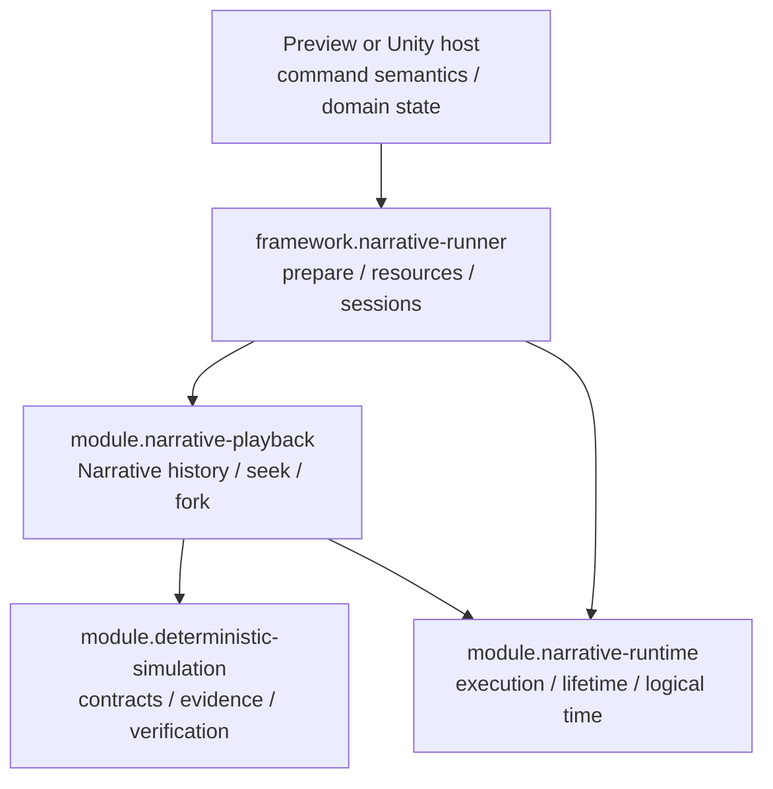

# Deterministic Simulation 模組邊界收斂方案

## 1. 決策摘要

現階段採用保守收斂方案：

- 保留獨立的 `module.deterministic-simulation`。
- 將其定位縮小為 domain-neutral contracts 與純資料／純比較工具。
- `module.narrative-playback` 繼續擁有 Narrative-specific history、checkpoint、seek、fork 與 reconstruction orchestration。
- 不把 logical time、runtime event、command lifetime 或 safe checkpoint 規則下沉。
- 等 Replay Lab 成為第二個正式 adopter 後，再依兩邊已證實相同的需求提升共用實作。

這次不調整 Language、Runtime、Playback、Runner、Preview、Application、Web 的主要依賴方向。

## 2. 目標依賴關係



依賴規則：

1. Deterministic Simulation 不引用 Narrative、Lab、Unity 或 host type。
2. Runtime 不引用 Playback 或 Deterministic Simulation。
3. Playback 可以引用 Runtime 與 Deterministic Simulation。
4. Runner 引用 Narrative modules，但 modules 不反向引用 Runner。
5. Host 透過 Runner 組裝 handler、state participant 與資源。

## 3. Deterministic Simulation 應保留的內容

### 3.1 穩定的核心型別

- `HistoryId`
- `StepIndex`
- `HistoryTarget`
- `RecordedInput<TInput>`
- `RecordedStep<TInput, TEvidence>`
- `StepCompletion`
- `DeterministicReplayDivergence`

### 3.2 可保留的純工具

- `ReplayVerifier`
- 純資料型 `SnapshotDescriptor<TSnapshot>`
- 純資料型 `ReplayPlan<TInput, TEvidence, TSnapshot>`

上述工具不得：

- 呼叫 host step；
- 擁有 application main loop；
- 決定何時可以 capture snapshot；
- 解讀 domain locator、logical time 或 runtime event；
- 執行 snapshot capture／restore；
- 重播外部副作用。

## 4. 暫不作為共用權威實作的內容

以下能力先留在各 adopter：

- snapshot catalog 的生命週期；
- snapshot retention／eviction；
- nearest-snapshot search orchestration；
- seek 執行流程；
- fork／branch ancestry；
- history truncation；
- stepper ownership；
- snapshot provider ownership；
- reconstruction budget 與 continuation；
- persistent artifact serialization。

因此，下列 API 應標記為 provisional、internal，或暫時移除公開承諾：

- `DeterministicHistory<TInput, TEvidence, TSnapshot>`
- `IDeterministicStepper<TInput, TEvidence>`
- `ISnapshotProvider<TSnapshot>`
- `SnapshotRetentionPolicy`

若目前只有測試使用而沒有兩個 production adopter，不應視為 stable public API。

## 5. Playback 保留的責任

`module.narrative-playback` 繼續擁有：

- `PlaybackTarget` 完整位置契約；
- RuntimeEvent history；
- logical time 與 same-time event ordering；
- execution identity；
- input arrival、input read 與 replay injection；
- Narrative checkpoint catalog；
- safe checkpoint capture 協調；
- restore + replay seek；
- bounded seek／continuation；
- Narrative fork 與 discarded suffix invalidation；
- active command lifetime reconstruction；
- Narrative-specific mismatch 驗證。

`HistoryTarget` 只作為 recorded-event prefix 的跨模組座標，不取代 `PlaybackTarget`。事件間的 tween、wake、active lifetime 與 logical-time position 不可只用 `HistoryTarget` 持久化。

## 6. 必須修正的契約問題

### 6.1 Fork 後 snapshot generation 不一致

目前 `DeterministicHistory.ForkAt` 增加 history generation，但直接沿用舊的 `SnapshotDescriptor`，可能形成：

```text
fork.Generation = 1
snapshot.Target.Generation = 0
```

建議修正：建立 fork 時重新建立 prefix snapshot descriptors，將 target 正規化為新 generation；snapshot payload 本身仍可共享，但 descriptor identity 必須屬於新 history generation。

驗收條件：

- fork 內每一個 step／snapshot target 都與 fork 的 HistoryId、SemanticRevision、Generation 一致；
- 舊 suffix target 失效；
- retained prefix 可解析為新 generation 的合法 target；
- snapshot payload 不因 descriptor 正規化而被修改。

### 6.2 SimulationId 與 HistoryId 語意混合

目前 `DeterministicSimulationId` 實際被當成 history identity 使用。應改為：

```csharp
public readonly struct HistoryId;
public readonly struct StepIndex;
public readonly struct HistoryTarget;
```

只有確定需要「一個 simulation 包含多個 history family」時，才另外加入 `SimulationId`。

### 6.3 StateDigest 不應強制為字串

`RecordedStep.StateDigest` 應採以下其中一種：

1. `string? StateDigest`；或
2. 完全移入 `TEvidence`。

推薦第二種。Digest 是 evidence 的一種，不是所有 deterministic transition 必備的核心欄位。

### 6.4 明確定義 StepCompletion

`RecordedStep` 應代表「已完成的一個 deterministic semantic transition」，而不是任意一次 pump／update 呼叫。

在這個前提下，`Completed`／`Faulted` 足夠；waiting、budget exhausted、cancelled 等操作狀態不應混入 step result。若需要記錄，應放在 adopter 的 operation result，而非 generic transition contract。

### 6.5 RecordedInput 必須保證不可變

`RecordedInput<TInput>` 目前只能保證 envelope 本身不可重新指定，無法保證 `TInput` payload 不被外部修改。

模組契約應要求 adopter 在 admission 時：

- encode 成 immutable payload；或
- deep copy；或
- 使用 immutable value type。

核心模組不應假設泛型物件天然不可變。

## 7. 建議的 API 分級

### Stable

- identities；
- ordered input envelope；
- recorded step data contract；
- divergence data contract；
- stateless verification。

### Experimental

- generic history container；
- generic snapshot catalog；
- retention policy；
- fork implementation；
- replay-plan builder。

### Narrative-owned

- PlaybackTarget；
- RuntimeEvent mapping；
- logical-time seek；
- active lifetime restoration；
- input arrival/read semantics；
- checkpoint eligibility；
- reconstruction context。

Experimental API 在有第二個 adopter 前不得被文件描述為跨專案穩定契約。

## 8. 遷移步驟

### Phase 1：文件與 API 標示

1. 更新 Deterministic Simulation README。
2. 區分 stable contracts 與 experimental implementation。
3. 明確記載 `HistoryTarget.Step` 是已納入 prefix 的 step/event 數量。
4. 明確記載它不能表示 event 間的 temporal state。

### Phase 2：修正核心型別

1. 將實際 history identity 改名為 `HistoryId`。
2. 修正 fork snapshot generation。
3. 將 digest 移入 evidence 或改為 optional。
4. 補充 payload immutability 契約。
5. 為 overflow、foreign target、revision mismatch 提供穩定錯誤分類。

### Phase 3：限制未成熟實作

1. 檢查 `DeterministicHistory`、snapshot retention、stepper/provider 是否存在 production consumer。
2. 沒有雙 adopter 的部分標記 experimental 或縮小 visibility。
3. Playback 不為了消除重複而強行改用 generic orchestration。

### Phase 4：Replay Lab 正式採用

先只採用：

- `HistoryId`／`HistoryTarget`；
- `StepIndex`；
- `RecordedInput`；
- `RecordedStep`；
- divergence contracts。

完成後比較 Lab 與 Narrative 的實際重複演算法。

### Phase 5：第二次抽象審查

只有當兩個 adopter 都需要且語意一致時，才提升：

- snapshot retention；
- fork ancestry；
- replay-plan construction；
- persistent history artifact；
- generic verification pipeline。

若只有資料形狀相似、生命週期或失效規則不同，維持各自實作。

## 9. 驗收清單

### Dependency

- [ ] Deterministic Simulation 無 Narrative、Lab、Unity 依賴。
- [ ] Runtime 無 Playback、Runner、Editor 依賴。
- [ ] Playback 無 Runner、Preview、Editor 依賴。
- [ ] Modules 不反向引用 Runner。

### Identity

- [ ] HistoryId、Generation、StepIndex 語意唯一且有文件。
- [ ] foreign history／revision／generation target fail closed。
- [ ] fork retained prefix 可正規化到新 generation。
- [ ] discarded suffix target 永久失效，不因新路徑到達相同步數而復活。

### Snapshot

- [ ] generic module 不決定 domain safe boundary。
- [ ] snapshot payload 為 detached immutable/deep copy。
- [ ] eviction 只影響效能，不影響 reconstruction correctness。
- [ ] initial snapshot pinning 屬 adopter policy，除非兩個 adopter證明完全一致。

### Replay

- [ ] replay 不重新讀取未記錄的非決定性值。
- [ ] mismatch fail closed。
- [ ] verification 不解讀 Narrative event 或 Lab tick。
- [ ] irreversible external effects 由 host policy 處理。

### API maturity

- [ ] stable API 至少有兩個 production adopters，或是不可再縮小的 value contract。
- [ ] experimental API 未被文件承諾為穩定跨專案介面。
- [ ] 沒有為了表面 DRY 而下沉 domain-specific orchestration。

## 10. 不在本次範圍

- 不重寫 Narrative Playback。
- 不把 Runtime logical time 改成 generic Step。
- 不重新切割 Runner／Preview。
- 不新增 Editor Infrastructure 層。
- 不更動 Language／Assets／Application／Web 邊界。
- 不設計跨 process save format。
- 不承諾 Unity compatibility 或 Unity package delivery。

## 11. 最終原則

共用模組只收納已由多個 adopter 證明相同的 invariant，不收納僅僅名稱相似的流程。

現階段的正確收斂結果是：

> Deterministic Simulation 提供中性的 identity、input、step、evidence 與 verification contracts；Narrative Playback 保留完整的 Narrative history 與 reconstruction semantics。等 Replay Lab 實際採用後，再把雙方真正重複且失效規則一致的演算法提升為共用實作。
