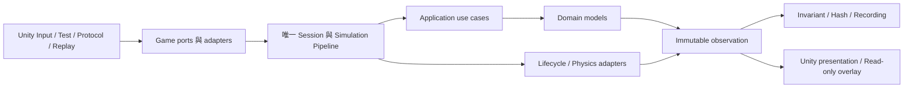

# Deterministic Simulation／Testability 重構與舊架構退役評估

評估日期：2026-08-30。程式碼基準：main／a2572d3（minimal example）。本輪只新增本評估文件，未修改 C#、場景、prefab、模組或外部試算表，也未刪除舊架構。

## 1. 判斷與建議

**新架構已經具備可用的 deterministic simulation 與 testability 主幹，不需要再做一次 ECS → DDD 重寫。接下來應先收斂兩套仍在使用的 gameplay runtime，再完成要保留的 Unity integration 能力。**

最重要的三項工作：

1. **只保留一份玩法與 session 執行語義。** Demo 已使用 GameplayDefinition／TestableSimulationSession；Protocol、部分 CLI 與舊格式 Replay 仍使用 GameplaySession。兩邊目前各自實作移動、攻擊、死亡、重生及控制生命週期。
2. **把「framework 保證」與「game／Unity 責任」說清楚並驗證。** 核心需要穩定的 phase／failure／控制權契約；Prefab、GameObject Pool、Collider 與畫面綁定不應因此進入核心。
3. **用同一個遊戲逐步增加接線。** 既有教材素材足夠，但混用 Player、CubeActor、CharacterMovement、直接 Pipeline 與兩代 Session。先建立唯一推薦路線，才容易看懂每個抽象解決什麼問題。

「可以完全捨棄舊架構」有兩個不同完成點：

| 完成點                                                                          | 現在距離                                                                   | 判斷                                  |
| ------------------------------------------------------------------------------- | -------------------------------------------------------------------------- | ------------------------------------- |
| A：Demo、manual tests、Protocol、CLI／Replay 全部不再需要過渡期 GameplaySession | Demo 已採新模板；其餘仍需控制路徑收斂、契約落差、工具遷移與 Unity 資產驗證 | 不必等待完整 Physics、Pool 或 Phase 5 |
| B：保留舊版有證據的 Unity runtime 能力後全面退役                                | 另需多物件實例綁定／Pool、Physics／碰撞事件、多物件呈現及 PlayMode 驗收    | 尚不能宣稱功能已完整替代              |

本評估對 B 採保守範圍：保留舊版程式碼或測試能證明的能力；不把舊 TODO、缺失實作或僅在規劃文件中的功能當作已完成能力。工作拆分與退出條件見第 9、10 節。

## 2. 依據與驗證範圍

參考資料是設計背景，文件中的命令式待辦不代表本次已授權執行或仍未完成：

- [DDD 重構摘要](<P:/Tutorial_Exercises/Replay and Simulation/replay-simulation-ddd-refactor-summary.md>)：作為責任邊界與歷史問題的對照。
- [Testability Phase 1–5 基準](<P:/Tutorial_Exercises/Replay and Simulation/testability-develop-baseline-phase1-5.md>)：作為能力與退出條件的對照，不視為最終規格。
- [模組規範：重用模組管理](https://docs.google.com/spreadsheets/d/1-TzU5YMFyduUNYYvw1tB1Nyi7y1xJDMZ_x5Kn0X4Ewk/edit?gid=1302588520#gid=1302588520)：已讀指定分頁 A1:N90，採其責任、依賴、命名及發布原則；未讀取無關分頁內容。
- 現行 Assets、tools/gameplay-checks、docs/framework-guide，以及 Old_Simulation 中尚存在的程式與測試。

本輪驗證：

| 項目                   | 結果與限制                                                                                                                                                  |
| ---------------------- | ----------------------------------------------------------------------------------------------------------------------------------------------------------- |
| 現行 C#／assembly 盤點 | Assets 下 112 個 C# 檔、36 個 asmdef，其中 21 個非 Tests assembly，包含 Editor integration                                                                  |
| asmdef 宣告依賴檢查    | 未發現宣告的循環依賴或 Module → Framework／Game；這是靜態圖檢查，非 Unity 編譯結果                                                                          |
| 既有 headless checks   | dotnet run --project tools/gameplay-checks/Gameplay.Checks.csproj 成功，9 行 PASS，涵蓋多組檢查                                                             |
| 局部行為探查           | 子稽核在記憶體驗證 nested dispatch、低階 Runner 失敗續跑、game 預算及 trace 差異；未修改原始碼。部分探查使用 PowerShell 的 .NET 10，不能替代 Unity 執行證據 |
| 場景／prefab           | 已靜態檢查舊腳本與 Build Settings 引用；未在 Editor 開啟驗證                                                                                                |
| 未執行                 | 完整 NUnit、Unity EditMode／PlayMode、Player Build、效能／GC／長時間測試、跨平台 replay                                                                     |

headless PASS 不是「所有測試通過」：其 csproj 將多個 src 合併編入單一 executable，只納入指定的 contract checks，未執行所有 NUnit，也不能獨自驗證 assembly 隔離。[E01]

## 3. 專案現況：其實有三個世代

### 3.1 現行能力與責任

| 區域                                                 | 現有責任                                                                                         | 評估                                                          |
| ---------------------------------------------------- | ------------------------------------------------------------------------------------------------ | ------------------------------------------------------------- |
| modules                                              | simulation primitives、wave dispatch、tick input、object registry、RNG、invariants、trace buffer | 已有合理的可重用機制；保留，不強加四層                        |
| framework.deterministic-simulation                   | Definition／Builder／Session、phase、訊息路由、tick、realtime ownership                          | 已有主幹；公開入口與 integration 時序契約需收斂               |
| framework.testability                                | 正式 Submit、按 tick／sequence 執行、observation、invariant、hash、failure、recording／replay    | 已有可測試閉環；具體 game 接線與舊工具功能尚未統一            |
| framework.gameplay-protocol                          | 方法註冊、permission、控制權、bounded ingress、owner pump、request 去重                          | in-process 核心已存在，不是完整外部服務                       |
| game/character-movement                              | Domain 值型別／行為、Application repository、framework adapters                                  | 適合作為教學主線；完整 Demo 未完全沿用同一條 Application 路徑 |
| game/character-combat                                | HP 與傷害模型                                                                                    | 簡單且隔離良好；不能只因目錄獨立就稱為完整 BC                 |
| game/gameplay-simulation                             | 場景、跨模型玩法、生命週期、hash、兩代 session/replay                                            | 現在最需要收斂的區域                                          |
| game/movement-demo、debug-overlay、gameplay-protocol | Unity 玩家入口、唯讀診斷、工具協定映射                                                           | 保持 adapter 身分，勿把玩法再寫一份                           |

### 3.2 三個世代不能混在一起處理

```text
① Old_Simulation：早期 ECS 架構殘留
   SimulationRunner → ISimulationWorld / Actor / Physics / Presentation
   World 與 Actor core 不完整，並非目前完整可執行的比較基準

② Assets 內的 GameplaySession：過渡期 DDD/game-specific runtime
   Protocol、CLI failure rerun、舊 ReplayArtifact 等仍在使用

③ 現行 Demo：通用 Definition／Session template
   Unity Host → MovementDemoSession → GameplayDefinition
   → TestableSimulationSession → SimulationSession / Pipeline
   → GameplayWorld → Movement / Combat models
```

② 已經不是早期 ECS，但仍是必須收斂的另一套 runtime。只刪除 ①，不會消除 ②／③ 的重複。

Old_Simulation 在 Assets 之外，現行 C#／asmdef／headless 路徑未找到對它的依賴；但現行 Unity 資產仍有歷史腳本引用，不能據此直接宣布整個 Unity 專案已與舊版斷開。[E02][E03][E04]

### 3.3 現在值得保留的設計

- Domain 不引用 Unity 或 simulation framework；時間、輸入及呈現由外圍提供。
- Intent、Internal Command、Event 分開；Replay 只重送外部輸入。
- Pipeline 註冊後 Seal；participant 以明確的註冊順序執行。
- Realtime driver 有排他控制權、catch-up 預算；Reset／Dispose 不可與持有中的 driver 任意混用。
- ObjectId、Handle.Generation、SpawnSequence 已分離；registry 不保存 ECS components 或 GameObject。
- 固定 RNG 演算法、numeric stream ID、狀態保存及獨立血量／重生 stream。
- cached observation、bounded trace、failure fingerprint、首次差異停止的 replay。

這些基礎是重構支點，不應為了套 DDD 形式而重寫。[E05][E06][E07]

## 4. Deterministic simulation 評估

### 4.1 正確的保證範圍

目前能支持的是：**在相同邏輯、相容 runtime、相同 scenario／seed、相同 target-tick／sequence 輸入下，重現此純 C# 邏輯切片。**

需要分清楚：

| 名稱                                         | 目前狀態                                                          |
| -------------------------------------------- | ----------------------------------------------------------------- |
| 同 runtime 邏輯重播                          | 已有實作與檢查                                                    |
| 不同 render frame schedule 播放同一錄製      | 已有 30／60／144 FPS 與不規則 delta 檢查                          |
| 不同 FPS 下真人按键自然產生完全相同輸入 tick | 不保證；輸入採樣時點仍會改變 target tick                          |
| Unity physics 行為等價                       | 尚未在現行架構接回並驗證                                          |
| 跨平台 bitwise determinism                   | 沒有承諾，也不是本輪退役前提                                      |
| 任意 tick snapshot restore／rollback         | 尚未提供；recording 從 scenario 重跑，不等於完整 runtime snapshot |

Hash 已包含方向、HP、RNG state、待重生 ticks 等會影響未來的狀態；但不同版本的 hash layout 不同，且排除未來外部 queue／部分 runtime 狀態。它是版本化的 gameplay 比較依據，不是存檔、完整 snapshot 或跨平台保證。[E08]

### 4.2 真正要優先處理的契約

**A. 正式入口收斂。**

基本 SimulationSession 已在 tick 例外後 Faulted，禁止繼續 Step；但公開低階 SimulationRunner 仍可直接使用，沒有相同 failure latch，AdvanceTime 也沒有新 realtime runner 的 catch-up 上限。

局部探查：Intent 先產生 Internal Command 再丟例外；直接 catch 低階 Runner 例外後再 AdvanceTick，上一個失敗 tick 的 command 在下一 tick 執行。正式 Session 路徑會阻止續跑，因此不是「正常 Demo 已經出錯」。建議教材只推薦 Definition／Session；低階 Runner 明確定位為底層，或補 fail-stop 契約，不維護兩種看起來都可直接當 production clock 的入口。[E09]

**B. WaveDispatcher 的重入防護。**

局部探查：先 enqueue 1、2；處理 1 時 enqueue 3，再 nested DispatchAll，實際收到 1、3，2 靜默遺失。BeginWave 清理正在被外層使用的 list，而 dispatcher 沒有重入 guard。允許 handler Enqueue 下一 wave，但應拒絕 nested DispatchAll，並明定 handler 中 Clear 的語義。影響是公開 module 的直接使用者；不誇大為現行 session 常態路徑故障。[E10]

**C. 多 participant 與 integration 的時序契約。**

目前固定 Composition Root 的註冊順序本身可以 deterministic，不需要僅為形式新增數字排序型別。缺的是可閱讀的接線順序表，以及多 participant／reaction／commit 可見性驗收。

目前行為是先 drain commands 的 waves，再 drain events 的 waves，必要時進下一 reaction cycle；wave 是各 dispatcher 的局部序號。不能把舊摘要的示意圖誤當成目前每一 wave 都只做一次 Command → Event。

Physics 與 Actor integration 接回時，要確定：

```text
PrePhysics domain changes + reactions 完成
→ 清除不該參與 physics 的舊 binding
→ Apply physics input → Simulate → Capture facts/state → Publish facts
→ reactions → PostPhysics
→ StructuralCommit 完成及其 reactions 的政策
→ instance reconciliation → presentation snapshot
```

可以先用一個 composite physics adapter 保證子步驟，不必把每個 Unity API 都變成全域新 phase。只有現有 extension point 無法清楚表達 barrier 時才加 core contract。尤其「commit 完成後還允不允許 reaction 改變結構」必須明定，不能靠註冊順序碰巧成立。[E05][E11]

**D. Identity 由機制回到語義。**

目前 game 把玩家視為 ID 1、以 Actors[0] 取玩家、以 SimulationObjectId 的數值建 CharacterId。固定範例中可成立，但教學需說明這是 mapping 政策，不是三者天然相同。建議先有 PlayerId／ActorRole 或明確 binding 查詢；不必立即建立三套 allocator。[E12]

### 4.3 不應再列成現行缺陷的項目

舊摘要的 event-only dispatch bug 確實仍可在 Old_Simulation 看見，但現行 MessagePipeline 已同時检查 command 與 event pending，reaction failure 也清兩個 buffer；局部探查驗證只有事件仍會派發。這一項是「已修復的歷史問題」，不是新的待辦。[E13]

## 5. Testability 評估

### 5.1 Phase 1–5 的真實成熟度

| Phase                 | 已有                                                                  | 還欠缺／本輪判斷                                                                                  |
| --------------------- | --------------------------------------------------------------------- | ------------------------------------------------------------------------------------------------- |
| 1 正式控制與觀察      | typed Submit、執行結果、observation、admin、Reset、唯讀 diagnostics   | 新舊入口預算／results／capabilities 尚未統一                                                      |
| 2 可控時間、RNG、順序 | fixed tick、唯一 driver、sequence、seed streams、重生排程             | 多 adapter 時序與 Unity integration 驗證，不是再新增 RNG 框架                                     |
| 3 Oracle／evidence    | invariant、canonical hash、bounded trace、首次 failure、record/replay | 新 game 自訂 oracle、causation metadata、工具及 artifact 政策需補齊                               |
| 4 外部 Protocol       | DTO、權限、控制權、bounded ingress、owner pump、去重、in-process JSON | 沒有實際 transport、外部 client、完整 timeout／cancel／reconnect 及 Unity pump 整合，不能判為完成 |
| 5 自動探索            | 固定 scenario rerun、正常及失敗 replay                                | 缺 RandomExplorer、candidate provider、非法輸入策略、wall-clock 保護與自動發現已知缺陷閉環        |

Phase 4、5 的新增能力不應阻擋舊 runtime 退役；但「目前已使用的 Protocol／CLI」必須遷到同一個 runtime，否則退役尚未完成。[E14]

### 5.2 遷移前要填平的具體落差

**A. 預算是雙重來源，已有不同結果。**

GameplayScenario 保存 MaxTicks／MaxActions；通用 CreateTestSession 若不傳 limits，卻採用 TemplateLimits 的 10,000 預設值。

局部探查以 maxTicks=1、maxActions=1 的 scenario 建立新 session，未傳 limits，兩個 input（tick 1／2）皆 queued，Step 兩次仍 Running，recording 的 MaxTicks=10000。Demo 特別手動映射 limits 才避免這個落差。

建議近期以 game session factory 強制由單一設定產生 limits；中期把 GameplayRules／Scenario 與 RunOptions 明確分開。不要讓通用 framework 反向理解 GameplayScenario。[E15]

**B. 診斷有序列，但內部連鎖缺因果關聯。**

新模板的 generic RecordDispatch 固定寫 sequence 0；Attack action 可見 sequence，ActorDamaged／ActorDied 卻缺對應 action、actor、target。舊 GameplaySession 有專案 metadata mapping。

這會降低「哪個輸入導致哪個內部反應」的定位能力，不等於 replay 已失敗。建議由 application execution context 或 event envelope 帶 causation，再透過專案 diagnostics adapter 映射；Domain 不應為 trace 繼承 framework 型別。[E16]

**C. 自訂 invariant 的 game 接點未承接。**

舊 GameplaySession 可註冊 invariant factory；新 GameplayDefinition 為 sealed，且固定註冊 GameplayInvariant。通用 ReplayableSimulationDefinition 已有 ConfigureInvariants extension point，不需要另造 oracle framework。

建議具體 game definition 接收固定的 invariant factory 設定，每個 session 建新 instance，並把診斷政策版本納入 recording。將既有非 crash failure → artifact → replay 契約遷移過來。[E17]

**D. 工具介面與格式不能只改 constructor。**

新 TemplatePorts 提供 Find(sequence)，但舊 Protocol 使用 results 分頁、capabilities、drive mode 等；需要明確的 game/tool adapter。不要讓新 framework 直接依賴舊 game DTO。

舊 ReplayArtifact／FailureArtifact 與新 TemplateRecording 並非同格式，hash layout 也不能直接互比。保守遷移策略是停止寫舊格式，保留必要的 reader／converter／舊 hash projector；每個 golden artifact 都驗證結果與 failure。無法保持歷史規則時，明確標示 unsupported 或交由封存版本執行，不悄悄拿新 hash 當舊 hash，也不永久維護第二套玩法。[E18]

### 5.3 目前測試缺口

DemoTemplateChecks 有 160 tick 新舊比對及 replay frame matrix，這很有價值；但 parity 迴圈的 Move 都是零向量，非零 Move 在比對結束後才執行。也沒有完整比對兩邊的 rejection、fault、Reset、預算、trace 與自訂 invariant。

退役前至少補同一組共享 scenario 驗收：非零／斜向移動、同 tick Move+Attack、攻擊距離邊界、死亡後行為、unknown/stale/duplicate、Stop／Reset／Fault、上限、seed streams、重生與舊 artifact。比較 ActionResult、結構化 observation、failure fingerprint；hash 只有在相同 canonical schema 下才直接比較。[E19]

## 6. Old_Simulation 的能力承接矩陣

舊 World 目錄已不存在，SimulationActor core 只剩 asmdef／meta。ActorPool／SimulationActors 的殘留測試可提取歷史契約，不能當成完整、目前可執行的原版。退役應採「能力驗收清單」，而非承諾把兩個完整系統逐項直接跑 parity。[E20]

| 舊能力／契約                                      | 新架構現況                                                                    | 退役判斷與應放的位置                                                                                     |
| ------------------------------------------------- | ----------------------------------------------------------------------------- | -------------------------------------------------------------------------------------------------------- |
| Fixed tick／phase                                 | 已有 Pipeline、Session、RealtimeRunner，且補 failure／control ownership       | 保留新主幹，不搬舊 Runner                                                                                |
| External input capture → tick consume             | 新 TickInputBuffer 已有 edge latch、held、latest axis、獨立 frame、排序／Seal | 已承接核心意圖；舊 clamp／16-bit quantization 與新 finite float 不等價，需記錄刻意變更或加 input adapter |
| Command／event 連鎖                               | 已獨立路由且修復 event-only bug                                               | 保留新訊息模型；不要搬回混用的 ICommand                                                                  |
| 全域身份／slot／generation                        | 新 registry 已有                                                              | 邏輯 handle 不代表 Unity instance handle；兩者分開 mapping                                               |
| Actor reconciliation before physics／after commit | 只有通用 phase 接點，Demo 無完整 actor binding coordinator                    | 如保留多物件能力，需要 lifecycle adapter 與可驗證時序                                                    |
| Prefab／GameObject pools                          | Demo 只建玩家 view 與一個輪流代表 active enemy 的 SpriteRenderer              | 尚未承接多物件 pool／bind／unbind／reuse；屬 Unity integration                                           |
| Script-driven physics simulation                  | 有 IPhysicsParticipant，Demo 沒有實作                                         | 補 Unity adapter，處理 simulation mode ownership、restore/dispose 與 callback 收集                       |
| Physics Apply／Capture 狀態                       | 舊 SimulationPhysics 對應方法本來就是 TODO                                    | 原有未完需求，不算新架構遺失；先決定權威狀態，再另估實作                                                 |
| Collision Enter／Stay／Exit facts                 | 舊 sink 有排序、去重與事件映射；新無對應實作                                  | 以穩定 object IDs 正規化 callback facts，由 adapter 映射到 application；不能沿用 callback 到達順序       |
| 多 actor position／rotation interpolation         | 新 Demo 主要只有玩家位置插值；敵人直接套 observation                          | 補依 ID 的 snapshots、spawn snap、despawn、tick discontinuity、rotation                                  |
| ECS components／filter／recipe                    | 新 Domain 已不依賴這些                                                        | 不恢復；要保留架構演進教材時放歷史附錄                                                                   |

來源：舊 Runner、Physics TODO／sink、Actor tests、presentation 與現行 Host。[E11][E20][E21][E22][E23]

如果遊戲永遠只採純邏輯 movement／combat，Physics／完整 Pool 可以明確不納入產品範圍；這時能達成完成點 A，但不能稱為已完整承接舊 Unity 能力。本報告的 B 估算包含它們，而不等待尚未定義的完整物理 snapshot／rollback。

## 7. 主 framework 究竟還少什麼

| 缺口                                                          | 應由誰負責                                                           | 優先程度                    |
| ------------------------------------------------------------- | -------------------------------------------------------------------- | --------------------------- |
| 唯一推薦的安全 runtime 入口、低階失敗契約                     | deterministic framework／指南                                        | 本輪                        |
| 多 participant ordering、reaction drain、結構可見時點         | deterministic framework contract + game composition                  | 接回 Actor／Physics 前      |
| committed lifecycle changes 到 instance reconciliation 的接線 | game coordinator + framework extension point；不一定需要新 core 類別 | 完成點 B 必要               |
| session owner-thread／受控輸入 ingress 的一致契約             | framework session／protocol adapter                                  | 工具收斂及外部 transport 前 |
| budget 設定唯一來源                                           | game factory／RunOptions；framework 提供通用限額                     | 本輪                        |
| trace causation 與專案 metadata 接點                          | testability contract／game diagnostics adapter                       | 退役舊診斷路徑前            |
| results／capabilities／oracle 對接                            | game/tool adapter；有第二個 consumer 再決定抽共用契約                | 退役舊 GameplaySession 前   |
| artifact policy／rules／schema 的相容性流程                   | testability 與 game codecs 分工                                      | 退役舊 Replay 路徑前        |
| GameObject／Pool／Collider／Transform 實作                    | Unity integration                                                    | 不放入主 framework          |
| 完整 snapshot restore、rollback、遠端 fuzzing                 | 未來獨立能力                                                         | 不屬於舊架構退役的必要門檻  |

核心需要的是**穩定的執行與擴充契約**，不是一個重新包辦 World、Actor、Physics、Test、Unity 的大物件。

SimulationWorld／GameplayWorld 作為 session 所有的狀態與服務容器沒有問題；需要避免的是讓它同時成為所有遊戲 use case、所有 framework handler 與所有生命週期策略。建議逐步抽出：

- GameplayActions／AttackUseCase：角色／目標／距離／傷害協調，返回專案結果。
- ActorLifecycleCoordinator：死亡、重生排程、registry 與 repository 一致性。
- GameplayDefinition：建立每次 session 的物件、明確註冊、codec／observer／invariant 接點。
- Unity adapters：输入、實例、physics、presentation；只經正式 port 接入。

名稱是建議責任，不是要求立即建立這些固定類名或每個類都加 interface。[E12][E24]

## 8. 與模組規範的符合度

| 規範                                                   | 現況                                                       | 建議                                                                                                                     |
| ------------------------------------------------------ | ---------------------------------------------------------- | ------------------------------------------------------------------------------------------------------------------------ |
| module 是宿主可組合的機制；framework 定義執行模型      | 現有分類大致正確                                           | deterministic／testability 保留 framework；RNG／buffer／registry 保留 module                                             |
| Module 可依賴穩定 contract／module，禁止依賴 Framework | 現行宣告圖沒有反向依賴或 cycle                             | 持續以 CI／分 assembly build 檢查，不能只靠單一 headless executable                                                      |
| Base 不用 .core；引擎整合用 .unity                     | 現有主要 reusable 根目錄符合                               | 若抽出生命週期驅動的 Unity extension，可用 framework.deterministic-simulation.unity；純 pool 演算法獨立可用才評估 module |
| 不強迫所有 repository 四層                             | 小 modules 現況合理                                        | 不為 RNG／trace／buffer 建空 Domain／Application                                                                         |
| Project 特例留在 Adapter／Composition                  | reusable sources 沒有依賴 game 類型                        | 遷移 Attack、ActorRole、重生策略時維持這個方向                                                                           |
| 採用專案統一解析依賴、禁止 nested submodule            | 本工作樹沒有 .gitmodules；目前是共同放在 Assets 的原型組裝 | 若正式抽庫，framework 只宣告版本／來源，由最外層安裝並鎖定；不要把 modules 內嵌到 framework repo                         |
| Framework 能獨立開發／CI                               | headless checks 是整合驗證，不是每個庫獨立 CI              | API 收斂後再做 external dev workspace／bootstrap、UPM tag；不要先拆 repo 放大移動成本                                    |

目前沒有看到既有 nested submodule 違規；也不能把單一 repository 原型說成已完成正式公司發布治理。

另有三個純 C# assembly（Framework.DeterministicSimulation、Module.SimulationPrimitives、Module.WaveDispatcher）尚未宣告 noEngineReferences。現在未見其 src 使用 Unity，不是現存引擎耦合，但可補編譯防線。既有 C#／教材也有 var；後續修改須遵守根 AGENTS.md 的明確型別規範，清理優先度低於行為收斂。

## 9. 還差多少：以八個可驗收工作包規劃

以下 S／M／L 是相對工作量，不是工日或完成百分比：S＝局部契約／修正，M＝跨數個類別／一條 adapter，L＝跨子系統及整合驗證。完整 Physics state sync 尚未有權威模型決策，因此不能提供可信固定工期。

| 工作包                            | 内容                                                                                   | 大小 | 依賴／退出條件                                                                                          |
| --------------------------------- | -------------------------------------------------------------------------------------- | ---- | ------------------------------------------------------------------------------------------------------- |
| R1 基準與契約清單                 | 保存 golden scenarios／artifacts，標示三個世代，補 parity matrix、input precision 決策 | M    | 不把現有 bug 固化成新規格；有一致／刻意差異清單                                                         |
| R2 核心與控制契約補強             | dispatcher 重入、低階 Runner 定位、ordering／failure tests、預算單一來源               | S–M  | 正式入口不可在 partial failure 後偷偷續跑；兩入口限額語義清楚                                           |
| R3 唯一 gameplay runtime          | 共用 use cases／lifecycle；GameplayDefinition 為主；舊 Session 暫轉 facade             | L    | 非零 movement、attack、death、respawn、results／fault 全走同一實作                                      |
| R4 工具／診斷／格式遷移           | Protocol ports、CLI、新 recording、自訂 oracle、trace metadata、legacy reader policy   | M–L  | 不再需要舊 session 執行玩法；舊 golden artifact 可驗證或明確拒絕                                        |
| R5 Actor instance integration     | 多物件 binding、pool、instance generation、commit reconciliation、失敗／清理           | L    | spawn→destroy→reuse、舊 handle 不綁新物件、Reset／Dispose 無殘留                                        |
| R6 Physics／collision integration | script simulation ownership、facts 收集／正規化、adapter、行為測試                     | L    | Enter／Stay／Exit 不重複，stale callbacks 不作用到新 object，mode 可復原；state sync 若另納入須追加估算 |
| R7 多物件呈現與 Unity 資產        | ID snapshots、spawn snap／despawn、rotation、tick discontinuity、更新 scene/build 入口 | M–L  | PlayMode 與 Player Build 跑現行 scene，無 missing scripts／舊引用                                       |
| R8 退役驗收與教學主線             | 移植必要舊 tests、移除仍活躍的 legacy callers、章節可執行、獨立依賴驗證                | M    | 不依賴舊碼／舊工具即可 build、test、record、replay；再移除封存來源                                      |

**完成點 A**：R1–R4，加 R7 的場景／build 清理與 R8 的對應驗收。這條線的難點是遷移一致性，不是缺一個全新的 simulation core。

**完成點 B**：八個工作包全部完成；R5–R7 是目前實質尚未替代的 Unity 能力。R5 可在 core 契約穩定後與工具遷移部分並行；R6／R7 依賴 binding／lifecycle 契約。

教學可以從 R1 開始同步整理，不需要等 Physics 做完才教第一個角色。正式拆 GitLab repositories／UPM 發布建議在上述 API 穩定後進行，不算「可停止使用舊架構」的必要工作。

不給 80%／90% 完成度：核心類別已多，不代表 Unity integration 工作只剩少量；以檔案數或已寫介面數估進度會低估 R5–R7。

## 10. 什麼時候可以真的刪除舊架構

### 10.1 先處理已找到的 Unity 資產殘留

- EditorBuildSettings 目前啟用 Assets/Scenes/SampleScene.unity，並非 CharacterMovementDemo。[E04]
- SampleScene 保留 TestCompositionRoot 的 script GUID；在此次搜尋的 Assets／Packages／Old_Simulation meta 中未找到其實作對應。[E03]
- Assets/Prefab/Player.prefab 保留 Player 舊 script GUID，另有 OnTriggerStayEvent，其 GUID 對應只在 Old_Simulation 中。[E02]

這是靜態證據，尚未以 Editor 確認實際 Missing Script 顯示。退役時應在 Unity 內查引用、整理資產、設定正式啟動場景並 build，不以手改 YAML 作為主要處理方式。

### 10.2 刪除前的必要清單

- [ ] 選定要保留的舊能力；每項有新驗收，或有明確「刻意不保留」決策。
- [ ] Demo、manual test、Protocol、CLI／Replay 使用同一套正式玩法執行實作。
- [ ] 舊 GameplaySession 不再是任何現行 consumer 的必要 runtime；相容 reader 不保留另一份玩法。
- [ ] 預算、結果碼、trace、custom invariant、failure、Reset／Stop、版本政策已完成對照。
- [ ] 編譯來源／asmdef 不引用舊 namespace 或 assembly；場景／prefab／Build Settings 無舊脚本殘留。
- [ ] 模組與 framework 契約測試、Unity EditMode、必要 PlayMode、現行 Player Build 實際通過。
- [ ] 原本只在 Old_Simulation 的有價值測試已移成新 port 契約，或有明確替代。
- [ ] normal recording 與 injected failure artifact 可從乾淨新 session 重播並定位第一個差異。
- [ ] Reset／Dispose／失敗後重建不殘留 callback、pool binding、physics mode、driver 或 RNG 狀態。
- [ ] 教材可不讀 Old_Simulation／舊 GameplaySession，從零完成同一個範例。

完成點 A 只驗收其產品範圍；完成點 B 加上多物件 Pool／Physics／presentation。保留 Git 歷史或 tag 作設計參考，不代表產品仍依賴舊架構。本輪未執行刪除、搬移或打 tag。

**不必為退役等待：**遠端 Named Pipe／socket、外部 client、自動探索、三個缺陷自動發現、完整 snapshot restore、rollback、跨平台 physics bitwise、多實例 orchestrator。這些是後續能力，不是恢復 ECS 的理由。

## 11. DDD／Clean Architecture 逐步接線教學

### 11.1 教學需要改什麼

現有 minimal-wiring 是好的起點，但推薦主線應從現有 CharacterMovement 持續成長，不必每章換成 Player／CubeActor 或改一套 game。直接 Pipeline 的機制解剖、過渡期 GameplaySession 與 ECS 歷史移到附錄。

目前 movement-demo README 還寫固定 30 HP、無 RNG、無通用 Replay；Host 已啟用 20–40 HP、隨機重生及 Replay。architecture／getting-started 的部分段落仍以舊 GameplaySession 為主，需要和 demo-template 的現行路線一致。[E25]

不要把 assembly＝BC、World＝aggregate、每個小型模型＝獨立 context。現有 Combatant 只是 HP／傷害模型，沒有獨立身份；先如實教成 gameplay context 內的模型即可。只有實際語言、所有權及規則邊界支持時，再論證 Movement／Combat 是不同 BC，而不是為符合 DDD 圖增加空 repository。[E26]

### 11.2 建議章節與每章退出條件

| 章               | 新增的責任                                                      | 可執行驗收                                                                                         |
| ---------------- | --------------------------------------------------------------- | -------------------------------------------------------------------------------------------------- |
| 0 導覽           | input → use case → state → observation；指出唯一權威狀態與入口  | 能指出改移速、讀鍵盤、保存世界各在哪裡                                                             |
| 1 純 Domain      | 同一 CharacterMovement，先不接 framework                        | speed=4、delta=.25，右移 X=1；SetDirection 不立即移動；非法輸入不改狀態；斜向不加速                |
| 2 Application    | 指定角色的用例；需要第二個角色才介紹 repository                 | unknown actor 明確結果；兩角色互不污染                                                             |
| 3 Fixed Tick     | Definition／handler／participant／observer                      | enqueue 不立即執行；一次 Step 前進一次；缺 handler 在初始化失败                                    |
| 4 Unity 接線     | 同一用例與模型，加 input、唯一 realtime driver、view            | 拖 Transform 不改 Domain；每 tick 只推進一次；低 FPS 仍按 tick 移動；先顯示 snapshot，再加插值     |
| 5 Testability    | target tick／sequence、結果、Admin／Gameplay／Diagnostics ports | queued 不等於 accepted；stale／duplicate；Reset session identity；唯讀不改 state                   |
| 6 攻擊／死亡     | AttackUseCase、Health 規則、event adapter、StructuralCommit     | 距離／死亡／自己等拒絕不扣血；kill 後同 tick 不再行動；destroy 一次；低 FPS 不重複消耗 attack edge |
| 7 RNG／診斷      | seed streams、延後重生、canonical state、invariant／trace       | 相同輸入重現；多次 Observe 不抽 RNG；hash 包含 future-affecting state                              |
| 8 失敗錄製／重播 | 注入一個非 crash invariant failure，artifact → replay           | 相同 failure tick／code／結果；篡改輸入可報首個 divergence                                         |
| 9 進階 Unity     | 多 actor pool／physics facts／presentation                      | 使用第 10 節對應的 PlayMode gates                                                                  |

Protocol、Explorer 是進階擴充，不放在初學者第一個角色動起來之前。

每章固定提供五項：解決的問題、依賴箭頭、新增／修改檔案、執行入口、預期結果。使用累積 chapters 或具名 scenario；程式片段對應參與編譯的來源，不只維護 Markdown 複本。章節選擇 CLI／lesson scene 是建議新增，現在尚非已提供功能。



圖示是執行資料流。編譯依賴仍由 adapter 指向內層契約；Domain 不反向依賴 Session、Testability 或 Unity。

## 12. 建議的第一個實作批次

先完成 R1＋R2 的最小部分，並讓 R3 有可驗證基準：

1. 將現行／過渡／ECS 歷史路線標示清楚，修正 Demo README 與預設入口資訊。
2. 建立共用 game 契約 scenarios，補非零移動、rejection、預算、Reset、custom invariant 與 failure parity。
3. 修正 game limits 雙來源，補 WaveDispatcher 重入契約；明定 low-level Runner 僅為底層入口。
4. 抽出一份 GameplayActions／lifecycle 行為，讓舊入口暫時只做相容轉接。

之後再遷移 Protocol／CLI 及 Unity capabilities。不要同批搬資料夾、改命名、改 action code、改 hash schema、改 physics authority又刪歷史 reader；變更過多會失去辨識差異原因的能力。

## 證據索引

- [E01：headless compile 範圍](<P:/Tutorial_Exercises/Replay and Simulation/tools/gameplay-checks/Gameplay.Checks.csproj:10>)。
- [E02：舊 Player prefab 腳本引用](<P:/Tutorial_Exercises/Replay and Simulation/Assets/Prefab/Player.prefab:96>)。
- [E03：SampleScene 舊 composition 引用](<P:/Tutorial_Exercises/Replay and Simulation/Assets/Scenes/SampleScene.unity:384>)。
- [E04：Build Settings 場景](<P:/Tutorial_Exercises/Replay and Simulation/ProjectSettings/EditorBuildSettings.asset:7>)。
- [E05：Pipeline phase 與 drain](<P:/Tutorial_Exercises/Replay and Simulation/Assets/framework.deterministic-simulation/src/API/SimulationPipeline.cs:80>)。
- [E06：Registry 身份與生命週期](<P:/Tutorial_Exercises/Replay and Simulation/Assets/modules/module.simulation-object-registry/src/Runtime/SimulationObjectRegistry.cs:23>)。
- [E07：Realtime driver](<P:/Tutorial_Exercises/Replay and Simulation/Assets/framework.deterministic-simulation/src/API/RealtimeSimulationRunner.cs:35>)。
- [E08：已宣告的 determinism／保存邊界](<P:/Tutorial_Exercises/Replay and Simulation/docs/framework-guide/contracts.md:54>)；[新 canonical state](<P:/Tutorial_Exercises/Replay and Simulation/Assets/game/gameplay-simulation/src/Runtime/GameplayDefinition.cs:38>)。
- [E09：低階 Runner 直接推進](<P:/Tutorial_Exercises/Replay and Simulation/Assets/framework.deterministic-simulation/src/API/SimulationRunner.cs:29>)；[正式 Session 的 fault](<P:/Tutorial_Exercises/Replay and Simulation/Assets/framework.deterministic-simulation/src/API/SimulationSession.cs:63>)。
- [E10：WaveBuffer／Dispatcher](<P:/Tutorial_Exercises/Replay and Simulation/Assets/modules/module.wave-dispatcher/src/Application.cs:22>)。
- [E11：舊 Runner 的 reconciliation／physics 時序](<P:/Tutorial_Exercises/Replay and Simulation/Old_Simulation/ReplayAndSimulationCore/SimulationCore/SimulationRunner.cs:71>)。
- [E12：GameplayWorld 玩法／角色約定／生命週期](<P:/Tutorial_Exercises/Replay and Simulation/Assets/game/gameplay-simulation/src/Runtime/GameplayWorld.cs:95>)；[Demo 角色選取](<P:/Tutorial_Exercises/Replay and Simulation/Assets/game/movement-demo/src/Composition/MovementDemoSession.cs:69>)。
- [E13：現行 MessagePipeline](<P:/Tutorial_Exercises/Replay and Simulation/Assets/framework.deterministic-simulation/src/Runtime/MessagePipeline.cs:104>)；[舊 event-only 問題](<P:/Tutorial_Exercises/Replay and Simulation/Old_Simulation/ReplayAndSimulationCore/CommandSystem/Application/CommandServices.cs:69>)。
- [E14：Protocol 的限制](<P:/Tutorial_Exercises/Replay and Simulation/Assets/framework.gameplay-protocol/README.md:45>)；[仍綁舊 session 的 adapter](<P:/Tutorial_Exercises/Replay and Simulation/Assets/game/gameplay-protocol/src/Runtime/GameplayProtocolAdapter.cs:13>)。
- [E15：預設 TemplateLimits](<P:/Tutorial_Exercises/Replay and Simulation/Assets/framework.testability/src/API/ReplayableSimulationDefinition.cs:33>)；[Demo 手動映射](<P:/Tutorial_Exercises/Replay and Simulation/Assets/game/movement-demo/src/Composition/MovementDemoSession.cs:35>)。
- [E16：新 trace dispatch metadata](<P:/Tutorial_Exercises/Replay and Simulation/Assets/framework.testability/src/API/TestableSimulationSession.cs:259>)；[舊 metadata mapping](<P:/Tutorial_Exercises/Replay and Simulation/Assets/game/gameplay-simulation/src/Runtime/GameplaySession.cs:429>)。
- [E17：舊自訂 invariant 接點](<P:/Tutorial_Exercises/Replay and Simulation/Assets/game/gameplay-simulation/src/Runtime/GameplaySession.cs:112>)；[新具體 definition](<P:/Tutorial_Exercises/Replay and Simulation/Assets/game/gameplay-simulation/src/Runtime/GameplayDefinition.cs:13>)。
- [E18：新 ports](<P:/Tutorial_Exercises/Replay and Simulation/Assets/framework.testability/src/API/TemplatePorts.cs:1>)；[舊 CLI rerun](<P:/Tutorial_Exercises/Replay and Simulation/tools/gameplay-checks/Program.cs:17>)；[新 TemplateReplay](<P:/Tutorial_Exercises/Replay and Simulation/Assets/framework.testability/src/API/TemplateReplay.cs:46>)。
- [E19：新舊 parity 與 frame matrix](<P:/Tutorial_Exercises/Replay and Simulation/Assets/game/gameplay-simulation/tests/DemoTemplateChecks.cs:23>)。
- [E20：殘留 ActorPool 契約測試](<P:/Tutorial_Exercises/Replay and Simulation/Old_Simulation/ReplayAndSimulationCore.Test/SimulationActor/Domain/ActorPoolTests.cs:24>)；[Actor reconciliation 測試](<P:/Tutorial_Exercises/Replay and Simulation/Old_Simulation/ReplayAndSimulationCore.Test/SimulationActor/Application/SimulationActorsTests.cs:52>)。
- [E21：舊 physics TODO](<P:/Tutorial_Exercises/Replay and Simulation/Old_Simulation/ReplayAndSimulationCore/Physics/Application/Application.cs:59>)；[Collision facts 正規化](<P:/Tutorial_Exercises/Replay and Simulation/Old_Simulation/ReplayAndSimulationCore/Physics/Infrastructure/PhysicsEventSink.cs:27>)。
- [E22：舊多 actor presentation](<P:/Tutorial_Exercises/Replay and Simulation/Old_Simulation/ReplayAndSimulationCore.Unity/Presentation/UnitySimulationPresentation.cs:43>)；[現行 Host](<P:/Tutorial_Exercises/Replay and Simulation/Assets/game/movement-demo/src/Unity/MovementDemoHost.cs:32>)。
- [E23：舊 input 精度測試](<P:/Tutorial_Exercises/Replay and Simulation/Old_Simulation/ReplayAndSimulationCore.Test/ExternalCommands/PlayerInput/InputReaderTests.cs:34>)；[新 input 契約](<P:/Tutorial_Exercises/Replay and Simulation/Assets/modules/module.tick-input-buffer/README.md:5>)。
- [E24：仍存在的另一份玩法](<P:/Tutorial_Exercises/Replay and Simulation/Assets/game/gameplay-simulation/src/Runtime/GameplaySession.cs:303>)。
- [E25：過時 Demo README](<P:/Tutorial_Exercises/Replay and Simulation/Assets/game/movement-demo/README.md:4>)；[已標示新模板的指南](<P:/Tutorial_Exercises/Replay and Simulation/docs/framework-guide/demo-template.md:19>)。
- [E26：目前 Combat 模型](<P:/Tutorial_Exercises/Replay and Simulation/Assets/game/character-combat/src/Domain/Combatant.cs:5>)。
