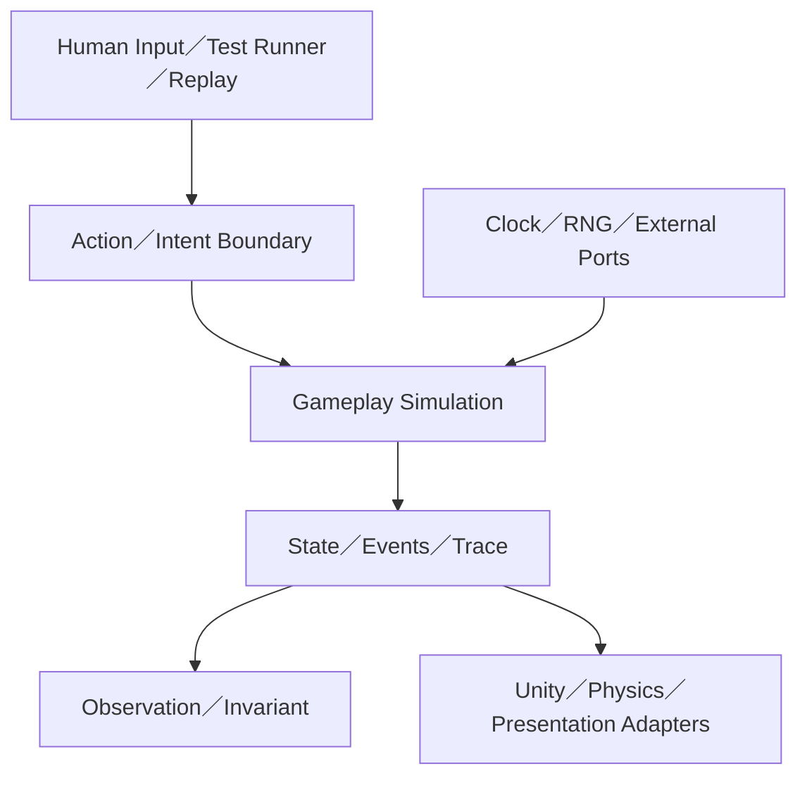

# 遊戲可測試性架構：開發基準（Phase 1–5）

> 文件定位：作為遊戲 Testability Architecture、Replay、Debug Protocol 與自動探索工具的共同研究基準。  
> 狀態：研究與開發規劃，不是最終產品規格。  
> 本版範圍：只規劃至 Phase 5；多實例 Orchestrator 與智慧探索不在本輪範圍。  
> 初始驗證環境：C#／.NET、Unity、單機單實例。

## 1. 課題意圖

建立一套可跨專案重用的遊戲可測試性架構，使遊戲不只能由玩家與引擎 callback 驅動，也能由測試、Replay、Debug Overlay、CLI 或外部 Runner，透過正式邊界進行控制與觀察。

本研究最終希望讓遊戲具備以下能力：

- 透過明確 Action／Intent API 執行遊戲行為。
- 控制 Tick、時間、亂數與其他非確定性來源。
- 查詢結構化狀態、事件、命令軌跡與錯誤原因。
- 以 invariant 自動判定狀態是否違反規則。
- 記錄失敗前的條件與行為序列，並可靠重播。
- 讓外置 Debug Overlay 與自動測試 Runner 共用同一套控制與觀察契約。
- 在不啟動完整 Unity 畫面時，測試可隔離的 Gameplay Simulation。

本課題的核心不是「增加更多測試案例」，而是讓產品架構具備：

1. Controllability：可控制性。
2. Observability：可觀察性。
3. Reproducibility：可重現性。
4. Isolation：可隔離性。

## 2. 問題定義

典型 Unity 程式會直接依賴 `Update()`、`Time`、`UnityEngine.Random`、Singleton、Transform、Animator 與 Scene lifecycle。這類程式即使能執行，也缺少測試所需的控制面：

- 無法精確指定輸入在哪一個 Tick 發生。
- 無法穩定重現亂數與執行順序。
- 無法只啟動需要測試的 Gameplay 規則。
- 無法結構化得知命令為何被接受或拒絕。
- 無法自動判斷畫面之外的隱性狀態錯誤。
- 找到錯誤後，通常只能靠人工操作嘗試重現。

因此，本研究處理的是產品架構的可測試性，不是 NUnit、Mock framework 或 CI runner 的使用方法。

## 3. 核心詞彙

| 詞彙 | 定義 |
|---|---|
| Game Action | 外部使用者、AI、Replay 或測試工具可要求執行的正式行為。 |
| Game Intent | 表達外部意圖、尚待 Application 層驗證與派送的輸入。 |
| Internal Command | 模擬內部為完成行為而產生的工作，不屬於外部 Replay 輸入。 |
| Observation | 對外提供的結構化狀態、事件、軌跡與診斷資料。 |
| Invariant | 任一合法狀態都必須成立、可由機器驗證的條件。 |
| Scenario | 人類可讀、只描述重要前置條件的測試情境。 |
| Snapshot | 精確、具版本、可供還原或診斷的邏輯狀態。 |
| Replay Record | 初始條件加上外部 Action／Intent 序列。 |
| Failure Artifact | 保存一次失敗所需的重現資料集合。 |
| Test Session | 一次隔離的模擬、測試或除錯生命週期。 |
| Game Control Plane | 統一的 Action、Observation、Tick、Invariant 與 Replay 邊界。 |

## 4. 架構基準



核心原則：

> 玩家輸入、Replay、測試工具與 Debug Overlay 應透過相同的正式 Application Boundary 驅動遊戲；測試專用狀態建構入口則必須與正常 Gameplay Action 分離。

### 4.1 Gameplay 與測試管理能力分離

正常 Gameplay Actions：

```text
move
attack
use_item
interact
accept_quest
equip
```

Test Fixtures／Administrative Actions：

```text
load_scenario
restore_snapshot
spawn_actor
grant_item
set_health
force_dependency_failure
advance_clock
```

測試管理入口可以建立特定條件，但不能取代真正 Gameplay Path 的測試。

### 4.2 DDD／Clean Architecture 對應

| Testability 概念 | DDD／Clean Architecture 對應 |
|---|---|
| Action／Intent | Application command 或 use case input |
| Handler | Application service；必要時協調 Aggregate 與 Domain Service |
| Invariant | Domain invariant 或跨聚合診斷規則 |
| Snapshot／Observation | Application read model 或專用 contract |
| Protocol DTO | Published Language |
| 外部 Runner／Overlay | Primary adapter |
| Unity、Physics、Storage | Secondary adapter |
| Clock、RNG、Asset、Network | Port |

外部協定不得直接成為 Domain Model：

```text
Protocol DTO
    ↓ mapping
Application Action／Intent
    ↓
Domain Behavior
```

### 4.3 外部行為與內部連鎖反應

- 外部輸入以 Action／Intent 進入 Simulation。
- Application Handler 驗證並執行對應 use case。
- 同一行為引起的內部連鎖反應使用 Domain Event、Application Event 或 Internal Command。
- Internal Command 不寫入外部輸入 Replay，避免重播時重複產生結果。
- Replay 記錄的是足以重新推導結果的外部輸入，以及必要的初始狀態、版本與 Seed。

## 5. 目前決策

| 項目 | 決策 | 理由 |
|---|---|---|
| 第一個驗證環境 | 純 C# Simulation 優先，Unity Adapter 隨後接入 | 先驗證控制與觀察邊界，不讓引擎生命週期遮蔽架構問題。 |
| 第一版執行模式 | In-process、單實例 | 降低 Transport 與 Process 管理干擾。 |
| 時間模型 | Fixed Tick | 可精確步進、快轉、Replay 與比較。 |
| 外部輸入記錄 | 記錄 Action／Intent，不記錄可重新推導的 Internal Command | 避免重播造成雙重副作用。 |
| 亂數 | Seeded、可注入，依用途拆分 stream | 避免不相關亂數消耗互相污染。 |
| Entity 識別 | 穩定 ID；不使用 runtime reference 或位址作為契約 | 支援 Snapshot、Replay、Trace 與跨程序協定。 |
| 註冊順序 | 初始化階段完成，Simulation 開始後鎖定 | 避免執行順序與 Handler 集合在運行中漂移。 |
| 狀態比較 | 先建立 Gameplay State Hash | 不將 Render-only、位址、牆鐘時間等不穩定資料混入。 |
| 錯誤判定 | 結構化 Result、Invariant 與 Exception 分開 | 業務拒絕不是例外，Invariant violation 也不是一般 log。 |
| Protocol | Phase 4 才加入；內部 API 先穩定 | 避免把尚未穩定的內部模型固化成遠端契約。 |
| 自動探索 | Phase 5 只做單實例、固定 Seed 隨機探索 | 先證明失敗能判定與重播，再提高吞吐量。 |

## 6. 明確非目標

本版不處理：

- 多程序、多機或雲端 Orchestrator。
- Port allocation、Crash dump 收集與跨實例資源排程。
- Coverage-guided fuzzing。
- Model-based testing。
- Property-based sequence shrinking。
- AI-assisted action planning。
- Unity PhysX 跨平台、跨版本 bitwise deterministic。
- 完整序列化所有 MonoBehaviour 或整個 Unity Scene。
- 以任意 private field 修改作為正式 Test API。
- 將每個 Unity API 都包裝成 interface。
- 讓 Debug Protocol 直接暴露 Domain Entity。
- 一開始就統一 Save Game、Scenario、Snapshot 與 Replay 格式。

## 7. 模組邊界基準

通用框架提供機制，遊戲專案提供語意。

```text
Testability.Core
├─ Sessions
├─ Actions
├─ Observation
├─ InvariantChecks
├─ Time
├─ Random
├─ Snapshots
└─ Replay

Testability.Runtime
├─ ActionRegistry
├─ ObservationRegistry
├─ InvariantRegistry
├─ TraceRecorder
└─ FailureCapture

Testability.Protocol
├─ Contracts
├─ Mapping
├─ Services
└─ Versioning

Testability.Runner
├─ ScenarioRunner
├─ RandomExplorer
├─ ReplayRunner
└─ ReportGenerator

Testability.Unity
├─ Bootstrap
├─ PlayerLoop
├─ SceneControl
├─ PhysicsAdapter
└─ UnityDiagnostics
```

框架可以定義：

```text
IGameAction
IActionHandler<TAction>
IStateObserver<TObservation>
IInvariant
ITestSession
ISnapshotProvider
```

專案負責定義：

```text
AttackAction
UseItemAction
CombatObservation
QuestInvariant
GameSnapshot schema
Action preconditions
```

## 8. 全階段共同工程規則

### 8.1 所有 Registry 必須可鎖定

- Handler、Observer、Invariant 與序列化映射只允許在初始化期間註冊。
- Session 開始後鎖定 Registry。
- 重複註冊、缺少 Handler 與不穩定順序必須明確失敗。
- 執行順序不能依賴 `Dictionary` 的偶然列舉結果。

### 8.2 所有外部要求必須有結構化結果

最低結果語意：

```text
Accepted
Rejected
InvalidRequest
Failed
```

拒絕結果至少包含穩定 Reason Code；不得要求 Runner 解析 log 字串。

### 8.3 邏輯狀態與呈現狀態分離

- Gameplay 成功與否以 Domain／Application 狀態為準。
- Animator、Audio、VFX 是結果的呈現，不是唯一真相。
- Presentation instruction 可以被觀察，但不進入第一版 Gameplay State Hash。

### 8.4 非確定性來源必須被盤點

每加入一個系統，必須判斷它是否依賴：

- 時間。
- 亂數。
- 執行順序。
- 物理結果。
- 非同步完成順序。
- 網路或檔案。
- Scene／GameObject lifecycle。
- 靜態可變狀態。

若它會影響待測結果，就必須能控制、記錄、替換或隔離。

## 9. Phase 1：建立遊戲內控制面

### 9.1 目標

讓純 C# 測試、玩家輸入 Adapter 與未來外部工具，都能透過一致的 Application Boundary 執行合法遊戲行為並讀取狀態。

Phase 1 不做遠端通訊，也不追求完整遊戲覆蓋。先挑選一個具代表性的垂直切片，例如：

```text
移動 → 攻擊 → 受傷 → 死亡
```

或：

```text
取得道具 → 使用道具 → 套用效果 → 消耗庫存
```

### 9.2 核心介面草案

```csharp
public interface ITestSession
{
    SessionId Id { get; }
    SessionState State { get; }

    void Start(TestScenario scenario);
    void Reset(TestScenario scenario);
    void Stop();
}

public interface IGameAction;

public interface IActionHandler<in TAction>
    where TAction : IGameAction
{
    ActionResult Handle(TAction action, IActionContext context);
}

public interface IStateObserver<out TObservation>
{
    TObservation Observe();
}
```

介面名稱仍可依現有 `GameIntent`／`CommandSystem` 語彙調整；此階段應先固定責任，不急著固定所有命名。

### 9.3 工作項目

- 建立 `ITestSession` 與明確 lifecycle。
- 建立 `IGameAction`、`IActionHandler<T>` 與 `ActionResult`。
- 建立 `ActionRegistry`，支援註冊、查找、重複檢查與鎖定。
- 建立 `IStateObserver<T>` 與 `ObservationRegistry`。
- 區分正常 Gameplay Action 與 Administrative Action。
- 將一個既有 gameplay flow 接到 Action Boundary。
- 為玩家輸入建立 Adapter，使其提交相同 Action／Intent。
- 建立純 C# in-process 測試 Driver。
- 為所有 rejection 建立穩定 Reason Code。

### 9.4 最小測試案例

- 合法 Action 會經由唯一 Handler 執行。
- 缺少 Handler 時明確失敗。
- 重複註冊 Handler 時明確失敗。
- Registry 鎖定後不能再註冊。
- 非法 Actor、Target 或參數被拒絕且狀態不變。
- Observation 可在 Action 前後取得差異。
- Administrative Action 不會被一般玩家輸入入口呼叫。

### 9.5 產出

- `Testability.Core` 初版。
- `Testability.Runtime` 的 Action／Observation Registry。
- 一個完整 gameplay 垂直切片。
- 純 C# in-process 測試 Driver。
- Action／Observation contract 測試。
- 一份 Action Catalog，列出行為、參數、前置條件與 rejection code。

### 9.6 退出條件

- 不需建立 UI 或模擬鍵盤輸入，即可由測試執行垂直切片。
- 玩家輸入與測試 Driver 經過相同的正式行為入口。
- 測試不透過 reflection 或任意 public setter 驗證結果。
- 每個 Action 都有可機器判讀的接受或拒絕結果。
- Session reset 後，不殘留上一案例的狀態或訂閱。

## 10. Phase 2：控制非確定性

### 10.1 目標

使相同初始狀態、相同 Action 序列與相同 Seed，在相同執行環境下能得到相同 Gameplay 結果。

### 10.2 核心介面草案

```csharp
public interface IGameClock
{
    long Tick { get; }
    TimeSpan FixedDelta { get; }
}

public interface IRandomSource
{
    int NextInt(int minInclusive, int maxExclusive);
    float NextFloat();
}

public interface IRandomStreams
{
    IRandomSource Combat { get; }
    IRandomSource Loot { get; }
    IRandomSource AI { get; }
}

public interface IGameSimulation
{
    long CurrentTick { get; }
    TickResult Tick(IReadOnlyList<IGameAction> actions);
}
```

### 10.3 工作項目

- 建立 Fixed Tick Simulation Loop。
- 禁止垂直切片核心規則直接讀取 `Time.time`、`deltaTime` 或 `DateTime.Now`。
- 建立 `IGameClock` 與測試用 Manual Clock。
- 導入 Seeded RNG。
- 依 Gameplay 用途拆分 RNG stream。
- 定義穩定 Entity ID 的建立與生命週期規則。
- 固定 System、Handler 與 Entity 處理順序。
- 定義同 Tick 多 Action 的排序規則。
- 盤點物理與非同步依賴，無法決定化者先建立清楚邊界。
- 建立 determinism regression test。

### 10.4 順序規則最低要求

必須明確定義：

- Tick 開始與結束時點。
- 外部 Action 在哪一階段收集、驗證與派送。
- Internal Command／Event 如何形成 wave，何時停止。
- 同優先序 Action 如何排序。
- Entity 容器如何保證穩定處理順序。
- Spawn／Destroy 何時生效。
- 最大 command wave／迴圈保護。

不得只依賴 `Dictionary`、HashSet、GameObject 查找順序或註冊偶然順序。

### 10.5 最小測試案例

- 同一 Seed 與 Action 序列連續執行多次，Gameplay 結果一致。
- 不同 RNG stream 不會因無關系統多抽一次亂數而互相污染。
- 同 Tick 多 Action 的結果不受提交容器列舉順序影響。
- 動態註冊或解除註冊在 Simulation 開始後被拒絕。
- Entity Destroy 後不再於後續 Tick 被執行。
- Internal Command wave 超限時產生明確錯誤，不會無限迴圈。

### 10.6 產出

- Fixed Tick Simulation Loop。
- Manual／Production Clock。
- Seeded RNG 與 stream policy。
- Stable Entity ID policy。
- Simulation order specification。
- Determinism regression test suite。

### 10.7 退出條件

- 垂直切片可用 `simulation.Tick(actions)` 推進，不必等待 Unity `Update()`。
- 測試可精確指定 Action 發生的 Tick。
- 相同條件在相同環境重跑時，Gameplay 結果穩定一致。
- 已知無法決定化的物理、非同步或 Unity 行為已被隔離並記錄限制。
- 執行順序已寫成規格與測試，而非只存在於程式碼偶然行為中。

## 11. Phase 3：建立自動判定與失敗診斷能力

### 11.1 目標

讓系統能自動判定「是否出錯」，並在錯誤發生時留下足以定位與重現的結構化資料。

只有 crash detection 不足以完成本階段。

### 11.2 核心介面草案

```csharp
public interface IInvariant
{
    string Code { get; }
    InvariantResult Evaluate(InvariantContext context);
}

public interface IStateHasher
{
    StateHash Compute(GameplayState state);
}

public interface ITraceRecorder
{
    void Record(TraceEntry entry);
    IReadOnlyList<TraceEntry> Snapshot();
}
```

### 11.3 Invariant 分類

至少區分：

| 類型 | 例子 |
|---|---|
| Local invariant | `Health` 必須位於 `[0, MaxHealth]`。 |
| Referential invariant | `TargetId` 必須指向有效 Entity。 |
| Lifecycle invariant | Dead Actor 不可接受 Move Action。 |
| Uniqueness invariant | Active Entity ID 必須唯一。 |
| Conservation invariant | 交易前後總資源守恆。 |
| State-machine invariant | Quest 不可同時為 Completed 與 Failed。 |

### 11.4 Structured Trace 最低內容

```text
Session ID
Tick
Action ID／Command ID
Action Type
Actor／Target
Received／Validated／Accepted／Rejected／Executed
Internal Command Wave
Event Type
Invariant Result
Exception
State Hash
```

Trace 必須設定容量與保留策略；不能讓長時間測試無限制占用記憶體。

### 11.5 State Hash 規則

第一版只建立 `GameplayStateHash`，並排除：

- Dictionary 未正規化順序。
- Runtime instance address。
- Render-only state。
- Cache 與衍生資料。
- 非決定性 GUID。
- 牆鐘時間。
- 未定義容差的浮點值。

所有集合先依穩定 ID 排序，再以明確欄位順序序列化／雜湊。

### 11.6 Failure Artifact 最低內容

```text
Failure ID
Build／Commit
Runtime Environment
Session ID
Seed
Scenario ID／Initial State
Action History
Failure Tick
Invariant Failure 或 Exception
Gameplay State Hash History
Structured Trace
Relevant Logs
```

Phase 3 不要求 sequence shrinking、影片或跨程序 crash dump。

### 11.7 工作項目

- 建立 `InvariantRegistry` 與鎖定規則。
- 為垂直切片撰寫第一批 invariant。
- 決定每 Action 或每 Tick 的評估時點。
- 建立穩定 `GameplayStateHash`。
- 建立 Action／Command／Event trace。
- 建立 `FailureCapture`。
- 區分 Rejection、Invariant Failure 與 Exception。
- 建立故意破壞狀態的框架自測案例，證明 oracle 能抓到錯誤。

### 11.8 產出

- Invariant Registry 與 Runner。
- 第一批專案 invariant。
- Gameplay State Hasher。
- Structured Trace Recorder。
- Failure Artifact schema 與 writer。
- 失敗報告範例。

### 11.9 退出條件

- 非 crash 的非法狀態能由 invariant 自動偵測。
- 合法的 Action rejection 不會被誤判為系統例外。
- 失敗報告可指出第一個失敗 Tick、Action 與 invariant code。
- 同一次 deterministic run 可產生相同 Gameplay State Hash 序列。
- Failure Artifact 不依賴人工複製 Console log 才能理解。

## 12. Phase 4：建立 Debug Protocol

### 12.1 目標

將 Phase 1–3 已穩定的 in-process Control Plane，以版本化 Published Language 暴露給 Debug Overlay、CLI 與外部 Test Runner。

Phase 4 的重點是協定與 mapping；Transport 第一版只需選一種可靠方式完成垂直切片。

### 12.2 服務邊界

```text
Session Service
Action Service
Observation Service
Simulation Service
Invariant Service
Trace Service
```

### 12.3 最小方法集合

```text
session.start
session.reset
session.stop
action.list
action.execute
observation.query
simulation.step
simulation.run_ticks
invariant.evaluate
trace.start
trace.stop
trace.read
```

Snapshot identity 可以預留在 Envelope 或 Capability 中，但若 Snapshot／Restore 尚未完成，不得宣稱支援。

### 12.4 Message Envelope 最低欄位

```json
{
  "protocolVersion": 1,
  "sessionId": "session-12",
  "requestId": "req-102",
  "sequence": 381,
  "method": "simulation.step",
  "payload": {}
}
```

### 12.5 Protocol 規則

- Protocol DTO 與 Application Action 分開定義並顯式 mapping。
- 每個 Request 都有 Request ID 與明確 Result。
- Session 與 Sequence 用於偵測過期、重複或錯序訊息。
- Capability negotiation 說明 Target 實際支援的方法與版本。
- 未知 action、未知欄位、版本不合與無權限操作皆有穩定錯誤碼。
- Transport thread 不得直接操作 Unity Object；命令必須排入受控執行點。
- 重送策略必須區分 query 與改變狀態的 command。
- Release Build 是否啟用控制能力，必須由明確設定與安全策略決定。

### 12.6 權限分級

最低分成：

| 能力 | 例子 |
|---|---|
| Read-only | 查詢狀態、事件、Trace。 |
| Gameplay control | 執行正常 Action、推進 Tick。 |
| Administrative | Reset、載入 Scenario、修改測試條件。 |

Overlay 預設不應自動取得 Administrative 能力。

### 12.7 工作項目

- 定義 Protocol Envelope 與版本規則。
- 定義六個服務的 request／response DTO。
- 建立 DTO ↔ Application mapping。
- 建立 Capability negotiation。
- 選定一種 Transport 完成 round trip；Windows 本機可優先使用 Named Pipe。
- 實作 disconnect、timeout、cancel 與 reconnect 行為。
- 實作 Action List，讓外部工具查詢可用行為及參數 schema。
- 建立 protocol contract tests。
- 讓既有 Debug Overlay 以相同 Protocol 查詢及控制垂直切片。

### 12.8 產出

- `Testability.Protocol` 套件。
- 第一版 Protocol specification。
- Target Endpoint 與一個最小 Client。
- Capability／Action Descriptor schema。
- Protocol contract test suite。
- Debug Overlay 垂直整合示範。

### 12.9 退出條件

- 外部 Client 能建立 Session、查詢 Action、執行 Action、步進 Tick、讀取 Observation 與 Trace。
- 未知訊息、版本不合、重複 Request、斷線與 timeout 行為都有自動化測試。
- Protocol DTO 不會直接滲入 Domain Model。
- 同一 Application API 可同時被 in-process Driver 與遠端 Client 使用。
- Target 主執行緒與 Transport 執行緒的責任清楚且可測。

## 13. Phase 5：單實例自動探索與失敗重播

### 13.1 目標

建立第一個真正能自動探索遊戲狀態、偵測 invariant failure，並輸出可重播失敗案例的單實例 Runner。

本階段先證明品質閉環：

```text
產生 Action
→ 執行
→ 評估 Invariant
→ 捕捉失敗
→ 重播
→ 確認同一失敗
```

### 13.2 Action Descriptor

外部 Runner 不應只隨機按鍵。Target 應提供可用 Action 的結構化描述：

```csharp
public sealed record ActionDescriptor(
    string ActionType,
    ParameterSchema Parameters,
    ActionCategory Category,
    string[] Preconditions,
    int EstimatedCost);
```

參數 schema 應能表達：

- 數值範圍。
- Enum。
- Entity reference。
- Inventory item reference。
- 目前狀態下可用的候選集合。
- Optional／Required。

### 13.3 第一版探索策略

只實作兩種模式：

1. 合法探索：從目前可執行的 Action 與合法參數候選中隨機選擇。
2. 邊界錯誤探索：以受控比例提交不存在、過期、重複或超界參數。

第一版不做 coverage feedback、AI planning 或 sequence shrinking。

### 13.4 Runner 輸入

```text
Build／Target identity
Scenario
Seed
Max ticks
Max actions
Wall-clock timeout
Action policy
Invalid-action ratio
Trace policy
```

### 13.5 Runner 每步流程

1. 讀取可用 Action Descriptor 與必要 Observation。
2. 由固定 Seed 的 Generator 選擇 Action 與參數。
3. 記錄尚未執行的 Action。
4. 提交 Action 並推進指定 Tick。
5. 保存 Result、Events 與 Gameplay State Hash。
6. 評估所有 invariant。
7. 若發生 failure、exception、timeout 或失去連線，立即封存 Failure Artifact。
8. 若未失敗，繼續直到達到案例上限。

### 13.6 Replay Record 最低內容

```text
Schema Version
Build／Commit
Configuration Version
Scenario／Initial Snapshot identity
Seed
Tick Rate
Ordered Action Sequence
Action Target Tick
Expected Failure Tick
Expected Failure Code
Expected Gameplay State Hash checkpoints
```

### 13.7 Replay 成功判定

重播不能只判定「程式沒有 crash」。至少應比對：

- 是否在預期 Tick 前後重現。
- 是否得到相同 invariant／exception code。
- Gameplay State Hash 是否在關鍵 checkpoint 一致。
- Action 接受／拒絕序列是否一致。

若 Unity 物理或非同步造成非 bitwise 差異，應明確標示為：

```text
Exact Replay
Behaviorally Equivalent Replay
Non-Reproducible
```

不得把不穩定重播偽裝成 deterministic replay。

### 13.8 工作項目

- 建立 `ScenarioRunner`。
- 建立固定 Seed 的 `RandomExplorer`。
- 建立合法參數 candidate provider。
- 建立受控的 invalid-action generator。
- 實作 action sequence recorder。
- 實作 `ReplayRunner`。
- 將 Phase 3 Failure Capture 接入 Runner。
- 建立 timeout、hang 與最大步數保護；單實例可以先在同程序或單一 Target 程序執行。
- 準備至少三個人為植入錯誤，驗證發現與重播流程。
- 產生可供人閱讀與機器處理的測試報告。

### 13.9 產出

- 單實例 Scenario Runner。
- Fixed-seed Random Explorer。
- Action sequence recorder。
- Replay Runner。
- Failure Artifact 與測試報告。
- 三個已知缺陷的發現／重播驗證案例。
- 單實例吞吐量與記憶體基準數據。

### 13.10 退出條件

- 相同 Seed、Scenario 與 Build 能產生相同 Action 序列。
- Runner 能自動發現至少一個非 crash invariant failure。
- 失敗後能直接由 Failure Artifact 啟動 Replay，不需人工重建條件。
- Replay 能重現相同 failure code 與近似 Tick；若不能，報告會明確標示差異。
- 合法探索與非法輸入探索的結果可區分。
- 長時間執行受 Max Tick、Max Action、Timeout 與 Trace 容量限制保護。
- 在單實例品質閉環穩定前，不開始多實例 Orchestrator。

## 14. Phase 1–5 依賴關係

| Phase | 先決條件 | 核心問題 | 完成後解鎖 |
|---|---|---|---|
| 1. Control Plane | 無 | 如何正式驅動與觀察遊戲？ | 可寫 in-process system test。 |
| 2. Determinism Control | Phase 1 | 如何精確控制時間、亂數與順序？ | 可穩定重跑與比較。 |
| 3. Oracle & Diagnostics | Phase 1–2 | 如何自動判斷錯誤並保存證據？ | 可進行長序列自動測試。 |
| 4. Debug Protocol | Phase 1–3 API 穩定 | 如何讓外部工具安全使用相同邊界？ | Overlay、CLI、外部 Runner。 |
| 5. Single-instance Exploration | Phase 1–4 | 如何自動找錯並形成重播閉環？ | 未來多實例與進階 fuzzing。 |

## 15. 跨階段驗收場景

使用同一個垂直切片持續擴張驗證，避免每個 Phase 都換一套示範。

建議範例：

```text
Scenario：低血量玩家對戰單一敵人

初始狀態：
- Player Health = 10
- Enemy Health = 30
- Player 擁有 1 個治療道具
- Combat RNG Seed = 814731

可用 Actions：
- player.attack(target)
- player.use_item(item)
- player.wait(ticks)

InvariantChecks：
- Health ∈ [0, MaxHealth]
- Dead Actor 不可再執行 Attack
- Inventory Count >= 0
- Active Entity ID 唯一
```

各 Phase 對同一場景增加能力：

| Phase | 驗收方式 |
|---|---|
| 1 | 測試可直接執行 Attack／Use Item 並查詢狀態。 |
| 2 | 固定 Tick 與 Seed 後，結果可重複。 |
| 3 | 血量越界或死亡後攻擊可被自動偵測與追蹤。 |
| 4 | 外部 Client 可透過 Protocol 執行相同流程。 |
| 5 | Random Explorer 可找到人為植入錯誤並以 Artifact 重播。 |

## 16. 每階段必要文件

每個 Phase 完成時至少更新：

- Decision Log：新增、修改或推翻的架構決策。
- Experiment Log：實驗條件、數據與結論。
- Risk List：尚未解決的非確定性與技術風險。
- Contract：新增或變更的公開介面與 schema。
- Test Evidence：自動化測試與驗收場景結果。
- Known Limitations：明確記錄不能保證的事項。

不得只以「原型跑得動」作為退出依據。

## 17. 主要風險

| 風險 | 可能後果 | 本版處理方式 |
|---|---|---|
| Action API 過度通用 | 失去專案語意，變成字串 RPC。 | 框架只提供機制，Action 由專案定義。 |
| Action API 過度貼合單一遊戲 | 無法跨專案重用。 | 只共用 Registry、Session、Result、Schema 等機制。 |
| 測試入口能任意改狀態 | 測到作弊路徑而非 Gameplay。 | Gameplay 與 Administrative 能力分離。 |
| 所有內部反應都記成 Replay Command | 重播時產生雙重副作用。 | 只記外部 Action／Intent，內部反應重新推導。 |
| 過早固化 Protocol | 遠端契約被不成熟內部模型綁死。 | Phase 1–3 先穩定 in-process API。 |
| 只看 State Hash | 難以定位差異原因。 | 同時保留 Action Result、Event、Trace 與 invariant。 |
| 追求完全物理決定性 | 研究停滯或抽象成本失控。 | 邏輯決定性優先；物理使用行為 invariant 與容差。 |
| Trace 無上限 | 長時間測試記憶體失控。 | Ring buffer、採樣與 failure window。 |
| 過早做多實例 | 放大不穩定、不可重播的測試。 | Phase 5 完成前明確禁止進入 Orchestrator。 |

## 18. 本版完成定義

本文件所述研究完成，不代表已完成通用遊戲 Fuzzing 平台；它只代表以下閉環成立：

```text
正式 Action Boundary
→ 可控 Tick／RNG／順序
→ 結構化 Observation／Trace
→ Invariant 自動判定
→ 外部 Protocol
→ 單實例隨機探索
→ Failure Artifact
→ Replay 驗證
```

只有當 Phase 5 的失敗案例能被穩定保存與重播，才值得另立下一版基準，研究：

- 多實例 Orchestrator。
- Session／Storage／Port 隔離。
- Hang／Crash 管理。
- Artifact 集中收集。
- Coverage-guided exploration。
- Sequence shrinking。
- Model-based／Property-based testing。
- AI-assisted action planning。

這些項目不屬於本文件的實作承諾。
